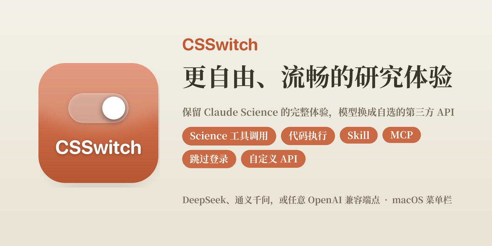

<p align="center">
  
</p>

<p align="center">
  
  
  
</p>

# BioCSSwitch — AI 生物医学研究平台

BioCSSwitch 将 AI 研究工作流、可审计证据和本地生物医学工具整合到一个研究工作区。打开应用后，研究者先选择要完成的工作，而不是先挑模型：

- **我要做文献综述**：多源检索、声明级引用核验、GRADE/SoF 与五段不确定性台账。
- **我要分析单细胞数据**：QC、注释、差异分析、轨迹与细胞通讯的可复现 recipe。
- **我要设计实验方案**：竞争假设、区分性实验、对照与关键数据需求。
- **我要发现和排序靶点**：统一编排文献、基因、药物、临床试验、单细胞与空间证据。

选择轨道后，工作台不会立刻把一个模糊问题扔给模型。它会先在本地把问题编译成带版本、内容哈希和必填边界的结构化任务书；识别不到的研究条件会逐项请研究者确认，未补齐就不启动。确认后的任务书作为可审计交接内容进入隔离研究空间；如果尚未配置模型，研究意图也会保留到连接验证完成，不需要重填。

模型连接是支持上述研究的基础设置，而非产品中心。BioCSSwitch 可在本地管理兼容模型服务，并按任务装配 MCP/Skill 工具包、任务路由和证据规则；研究结论始终需要由研究者复核。

> 本仓库发布 Linux x64 版，支持 Ubuntu 22.04+ 与 Debian 12+。启动 BioCSSwitch 前请先安装 Linux 版 Claude Science。

[研究平台介绍与示例输出](./docs/index.html) · [下载最新版](../../releases/latest) · [更新日志](./CHANGELOG.md) · [报告问题](https://github.com/HERRY423/BioCSSwitch-Linux/issues/new?template=bug_report.yml) · [功能建议](https://github.com/HERRY423/BioCSSwitch-Linux/issues/new?template=feature_request.yml)

BioCSSwitch 会把这个地址指向本地代理。代理收到请求后，会移除 Science 附带的 OAuth 信息，换成你的第三方 API Key；如果服务商使用不同的接口格式，代理还会负责协议转换，最后把请求发给你选择的模型。

Science 启动所需的登录状态则由 BioCSSwitch 在隔离环境中生成。这套本地登录只负责让 Science 启动，不参与后续推理，也不会接触你真实的 Claude 登录信息。

## 研究平台与本地运行时

Claude Science 是 Anthropic 面向科研与分析场景的 AI Agent 应用，可以做文献分析、数据处理、代码执行、图表生成和论文写作等工作。但 Science 默认依赖 Claude 登录和 Anthropic 推理服务。

CSSwitch 做的是本地运行控制：

- 在隔离环境里启动 Claude Science。
- 为 Science 准备一份本地生成的启动门票，不复制你的真实 Claude 登录信息。
- 把 Science 的模型请求转发到你选择的第三方 provider。
- 在需要时把 Anthropic Messages API 和 OpenAI 兼容接口互相转换。
- 保留「官方 Claude」模式，让有订阅的用户可以随时回到真实 Science。

简单理解：CSSwitch 之于 Claude Science，类似 CC Switch 之于 Claude Code，但 Science 多了登录门票和沙箱隔离这层复杂度。

```text
Claude Science sandbox
  -> CSSwitch local proxy
  -> DeepSeek / Qwen / Kimi / MiniMax / GLM / OpenRouter / custom endpoint
```

## 平台能力

BioCSSwitch 继承自 [SuperJJ007/CSSwitch](https://github.com/SuperJJ007/CSSwitch)，CSSwitch 的名字和产品形态参考了 [CC Switch](https://github.com/farion1231/cc-switch)，后者是一款使用 Tauri 和 Rust 开发的 Claude Code API 服务商切换工具。BioCSSwitch 与这些项目彼此独立，不存在从属或背书关系。

- 用桌面面板管理多套模型配置，不需要手改环境变量。
- 同一家 provider 可以保存多套配置，例如不同 Key、不同模型、不同中转地址。
- 点击「设为当前」前会先验证 Key；失败不会悄悄切换到坏配置。
- 点击「一键开始」会自动启动代理、准备隔离环境、打开 Science。
- Science 顶部模型选择器会显示你选择的真实模型名，而不是笼统的 `claude` 或 `opus`。
- 可以一键切回「官方 Claude」模式，不干扰你的真实 Claude 登录。

**研究工作流与可复核输出**

- **装好就能用**：新建一条第三方配置、填入 API Key、设为当前，点击「一键开始」，BioCSSwitch 会自动启动代理和隔离环境，并打开已经完成本地登录的 Science。虚拟登录由 Rust 原生实现，不需要另外安装 Node.js。
- **重复点击也不会打乱状态**：「一键开始」会先检查当前运行状态。窗口关了就重新打开，代理停了就重启代理，隔离环境没启动就补上。它不会反复生成登录身份，也不会把正在使用的会话切换到其他组织。发现连接异常时，还会先检查并尝试自动恢复。
- **随时切回官方 Claude**：如果你有 Claude 订阅，可以在面板顶部切换到「官方 Claude」。切换后，BioCSSwitch 不会再启动代理或隔离环境，也不会干预你的官方登录。
- **保留模型原生能力**：DeepSeek 通过原生 Anthropic 端点接入，不需要额外转换协议，可以更完整地保留 Thinking 和工具调用等能力。
- **自己挑模型，显示也不含糊**：每个服务商都能在下拉里选择我们维护的主流模型，也可以直接填写任意模型名。填好后，Science 顶部的模型选择器会显示你选择的真实模型名（例如 `glm-5.2`），而不是笼统的 claude。
- **启用前会校验 Key**：把一条配置「设为当前」或修改正在生效的连接时，BioCSSwitch 会先发一条最小请求验证 Key，通不过就自动回退、不会谎报已生效。（新建配置只保存、不联网，验证留到启用那一步。）
- **内置生物医学工具包**：覆盖 PubMed / Europe PMC / Crossref / bioRxiv / ClinicalTrials.gov / ChEMBL / Open Targets / HGNC / MeSH / UniProt / Ensembl 等本地 MCP 与 Skill 工作流，并提供证据审计、GRADE/SoF、PHI 脱敏、隐私红队和 provider benchmark。
- **主动研究伙伴**：`bio-research-partner` 在显式 opt-in 后只用结构化事件更新本地 HMAC 兴趣模型，不保存原始提示或行为流水；可预测粗粒度工作流、生成论文/预印本/临床试验刷新计划并本地排序候选，支持检查与彻底删除。
- **矛盾驱动假设生成**：`kg_generate_hypotheses` 把 KG 中相反方向的证据拆成已观察冲突、竞争假设、可证伪预测、区分性实验和关键数据需求；生成内容永不自动写回为证据。
- **跨模态统一推理**：`bio-crossmodal` 用一个可序列化 EvidenceContext 编排文献、基因、药物、试验、单细胞和空间证据，显式报告交叉验证、冲突、缺失模态与靶点优先级；“没查到”始终是未知，不会伪装成反证。
- **单细胞与 scFM 工作流**：提供 `bio-singlecell`、`bio-scfm`、`bio-sc-downstream`、`bio-sc-atlas` 与 `sc-analysis`，生成 QC、doublet、batch、cell type annotation、Geneformer/scGPT/CellFM/UCE embedding skeleton、DEG、trajectory、cell-cell communication 和 CELLxGENE 下载配方。
- **机器学习突破板块**：提供 `bio-ml` 与 `biomedical-ml-strategy`，把多模态基础模型、虚拟细胞/扰动预测、AI 药物发现、联邦学习、临床 ML 验证门和自驱实验室做成可复现 recipe、不可误跑的 skeleton、provenance 与 claim-scope gate。
- **方便检查更新**：可以从面板直接打开 GitHub Releases，查看和下载新版本。

### 与真实账号隔离

- **不读取真实登录凭证**：Science 启动所需的登录状态由 BioCSSwitch 在本地生成。你的 `~/.claude-science` 不会被复制、修改或删除。
- **不干扰真实 Science**：隔离环境拥有独立的 HOME、端口和数据目录，不会占用真实 Science 使用的 8765 端口。程序也为真实数据目录和端口设置了保护措施，一旦发现可能发生冲突，就会停止操作。
- **API Key 只保存在本机**：密钥以 `0600` 权限保存在 `~/.csswitch`，并通过环境变量传给子进程，不会写入命令行参数或日志。界面只显示经过遮盖的末四位。
- **代理只接受本机请求**：代理仅监听回环地址，并通过路径 Secret 验证请求。传入请求中的 `Authorization` 和 `x-api-key` 会先被移除，不会被原样转发给第三方服务商。

## 支持的第三方 API

在面板里「＋ 新建」一条配置并选择来源即可，同一家也能保存多套（不同 Key / 不同模型）：

| 来源 | 接入方式 | 模型 |
|---|---|---|
| **DeepSeek**（默认） | 原生 Anthropic 端点，无需转换协议 | 内置映射，保留 Thinking 与工具调用 |
| **通义千问（Qwen）** | DashScope OpenAI 兼容端点，代理转换协议 | 内置映射 |
| **智谱 GLM** | 内置 Anthropic 兼容端点 | 下拉精选或自填 |
| **Kimi（Moonshot）** | 内置 Anthropic 兼容端点 | 下拉精选或自填 |
| **MiniMax** | 内置 Anthropic 兼容端点 | 下拉精选或自填 |
| **小米 MiMo** | 内置 Anthropic 兼容端点 | 下拉精选或自填 |
| **硅基流动** | 内置 Anthropic 兼容端点 | 下拉精选或自填 |
| **OpenRouter** | 内置 Anthropic 兼容端点 | 下拉精选或自填 |
| **自定义端点** | 自填任意 OpenAI / Anthropic 兼容端点 | 自填模型名 |

每个服务商都可以在下拉里选择我们维护的主流模型，也可以直接填写任意模型名；填好后，Science 顶部的模型选择器会显示你选择的**真实模型名**（例如 `glm-5.2`），而不是笼统的 claude。本地 Ollama 等更多来源仍在计划中，见下方「更新计划」。

## 快速开始

开始之前，请确认你已经安装：

1. 从最新的 [Release](../../releases/latest) 下载 `BioCSSwitch_*.dmg`，然后把 BioCSSwitch 拖入「应用程序」。由于当前版本尚未经过 Apple 公证，第一次启动时请右键应用并选择「打开」。
2. 打开 BioCSSwitch，保持顶部选择「**第三方模型**」，点「**＋ 新建**」，选择来源、粘贴自己的第三方 API Key，点「**创建**」。密钥只保存在本机 `~/.csswitch` 目录下（`config.json` 及其滚动 / 迁移备份，均为 `0600` 权限），不会离开你的电脑。
3. 在列表里点这条配置的「**设为当前**」。BioCSSwitch 会先校验 Key 再启用，通不过会提示、不会切换。
4. 点击「**一键开始**」。BioCSSwitch 会依次启动代理、写入本地登录状态、启动隔离环境，并在浏览器中打开 Science。

> 你只需要准备自己的第三方 API Key，其余步骤由 BioCSSwitch 自动完成。
>
> 如果应用被 Gatekeeper 拦截，可以右键选择「打开」，或者前往「系统设置 → 隐私与安全性」并点击「仍要打开」。当前版本仅支持 Apple Silicon（arm64）。

如果你有 Claude 订阅，只想正常使用官方 Claude Science，切到「官方 Claude」模式即可。CSSwitch 会停止第三方代理链路，再打开真实 Science。

## 支持的模型来源

| 来源 | 接入方式 | 说明 |
|---|---|---|
| DeepSeek | 原生 Anthropic 端点 | 默认来源，尽量保留 thinking、工具调用和流式能力 |
| 通义千问 Qwen | OpenAI Chat Completions 兼容端点 | 由 CSSwitch 代理转换为 Science 需要的 Anthropic 格式 |
| 智谱 GLM | Anthropic 兼容端点 | 可编辑官方默认地址，可选择或自填模型 |
| 小米 MiMo | Anthropic 兼容端点 | 支持改到套餐或区域端点 |
| 硅基流动 | Anthropic 兼容端点 | 可选择或自填模型 |
| Kimi / Moonshot | Anthropic 兼容端点 | 可编辑官方默认地址，支持 Kimi 系列模型 |
| MiniMax | Anthropic 兼容端点 | 可编辑官方默认地址，支持 MiniMax 系列模型 |
| OpenRouter | Anthropic 兼容聚合入口 | 可选择或自填模型 |
| 自定义 Anthropic | 自填兼容端点 | 适合私有网关、Claude 兼容中转站、本地适配器 |
| 自定义 OpenAI | 自填 OpenAI Chat Completions base root | 代理自动补 `/chat/completions` 与 `/models` |
| 自定义 OpenAI Responses | 自填 OpenAI Responses base root | 代理自动补 `/responses` 与 `/models` |

> 如果你的地址是 `/anthropic` 端点，请选择「自定义 Anthropic」。如果选择「自定义 OpenAI」，请填写 OpenAI 兼容的 base root，例如 `https://example.com/v1`，不要填 Anthropic 端点。

## 它如何保护你的真实账号

CSSwitch 的核心边界是：第三方模型模式只操作隔离环境，不接管你的真实 Claude 账号。

- 不复制、读取或修改真实 `~/.claude-science`。
- 隔离 Science 使用独立 HOME、独立端口和独立数据目录。
- 第三方 API Key 保存在 `~/.csswitch/config.json`，文件权限为 `0600`。
- Key 通过环境变量传给本地代理，不写入命令行参数或日志。
- 代理只监听 `127.0.0.1`，并使用路径 secret 验证请求。
- 代理收到请求后会移除 Science 自带的 `Authorization` / `x-api-key`，再注入你配置的第三方 Key。
- 官方 Claude 模式会拆掉第三方代理链路，再把你交回真实 Science。

## 哪些能力暂时用不了

CSSwitch 不是 Claude 官方服务，也不会让本地生成的启动门票获得 Anthropic 账号权限。以下限制是当前架构边界：

- Anthropic 托管的远程 MCP 服务不可用，例如 `pubmed`、`clinical-trials`、`chembl`、`biorxiv` 等 `*.mcp.claude.com` 服务。
- 依赖真实 Claude 账号授权的目录连接器、远程插件、云端能力可能会显示 session expired、unavailable 或 skipped。
- 第三方模型对工具调用、长上下文、thinking、图片和流式输出的兼容程度不同；原生 Anthropic 端点通常比 OpenAI 翻译路径更稳。
- 当前 macOS 包尚未 Apple 公证，首次启动需要手动放行。
- 当前运行时仍依赖 `python3` 启动代理；移到 Rust 单二进制是后续计划。
- 发布包会内置代理所需的 `httpx + h2` 纯 Python 依赖；源码运行请先执行 `python3 -m pip install -e .`。代理复用连接池，并在上游支持时协商 HTTP/2。

已知问题和排期见 [docs/known-issues.md](./docs/known-issues.md)。

- **报告问题**：[新建 Bug 反馈](https://github.com/HERRY423/BioCSSwitch-Linux/issues/new?template=bug_report.yml)，也可以点击面板右下角的「反馈 / 报 bug」。
- **提出功能建议**：[新建功能建议](https://github.com/HERRY423/BioCSSwitch-Linux/issues/new?template=feature_request.yml)，告诉我们你希望支持的模型或 API。
- **附上日志**：面板中的「日志」链接会打开 `~/.csswitch/logs/`，其中包含 `proxy.log` 和 `sandbox.log`。日志可以帮助定位问题，但**提交前请务必删除其中的 API Key 和令牌**。

BioCSSwitch 不包含自动遥测或崩溃上报，也不会在后台上传你的数据。只有你主动提交的反馈，才会离开本机。

<p align="center">
  
</p>

## 开发与构建

用户不需要从源码运行。以下内容只给想调试或参与开发的人。

```bash
cd desktop
npm install
npm run tauri dev
```

常用检查：

```bash
cd desktop/src-tauri
cargo test

cd ../..
python3 -m pip install -e ".[dev]"
python3 -m pytest test
```

CI 在 PR、主分支推送和每周定时任务中执行 `cargo audit`、`pip-audit` 与 Gitleaks；Dependabot 同步跟踪 Cargo、Python、npm 和 GitHub Actions 依赖更新。

更多开发说明见：

- [desktop/README.md](./desktop/README.md)
- [docs/DEVELOPMENT.md](./docs/DEVELOPMENT.md)
- [docs/provider-support.md](./docs/provider-support.md)
- [docs/verified-facts.md](./docs/verified-facts.md)
- [主动研究伙伴与跨模态编排](./docs/research-partner-crossmodal.md)

## 风险与免责声明

- 本项目仅供个人学习与研究使用，使用风险由用户自行承担。
- CSSwitch 与 Anthropic 不存在从属、合作或背书关系。
- 推理请求会发送到你自行配置并付费的第三方模型服务。
- 本地生成的 Science 启动门票不包含真实 Anthropic 凭证，也不授予 Anthropic 官方账号权限。
- Science 启动时仍可能访问内置的 profile、account 或服务发现接口；CSSwitch 会在第三方模型模式下尽量把这些请求隔离或快速失败，因此本文不使用「完全不接触 Anthropic」这类绝对表述。
- 对 Science 登录令牌加密格式的分析和本地启动门票实现，可能涉及相关服务条款与法律问题。具体适用性应由专业人士判断。
- 软件按「现状」提供，不作任何形式的担保。

## 致谢

CSSwitch 的名字和产品形态参考了 [CC Switch](https://github.com/farion1231/cc-switch)。两个项目彼此独立，不存在从属或背书关系。

## 许可

[MIT](./LICENSE)
