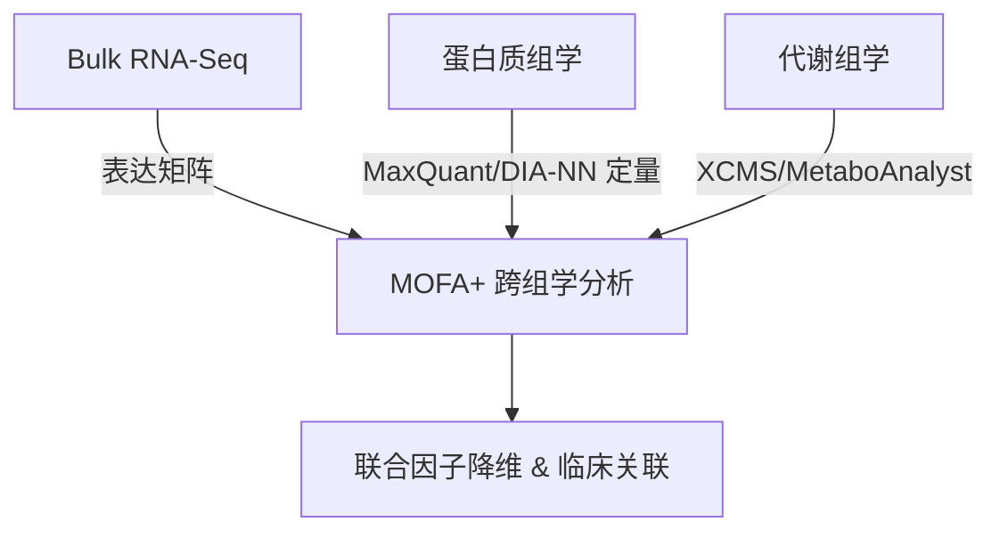

# BioCSswich 生物信息学能力扩展提案

为了进一步促进 BioCSswich 的项目进化，将其打造成一个更加全面的 AI 科研平台，我们可以将研究领域从目前的**“单细胞（scRNA-seq）”和“药物靶点/文献检索”**扩展到以下五个前沿的生物信息学分支。

延续 BioCSswich 的核心设计哲学：**“不代跑大体量计算，只在本地生成可复现的配方（Recipes）、脚本骨架与出处追溯（Provenance）”**。

---

## 拟引进的项目与功能矩阵

| 研究方向 | 拟引进的开源项目 / 数据库 / 工具 | 拟新增的 MCP 工具 / 服务 | 赋能的科研工作流（Skills） |
| :--- | :--- | :--- | :--- |
| **1. 结构生物学与分子模拟** | AlphaFold 3 · ESMFold · PyMOL · Foldseek · AutoDock Vina / DiffDock · GROMACS | `pdb_search`, `foldseek_align`, `docking_recipe`, `pymol_render_script`, `md_simulation_recipe` | `protein-structure-docking` (蛋白结构比对、分子对接与动态模拟) |
| **2. 群体遗传学与变异注释** | ClinVar · gnomAD · dbSNP · Ensembl VEP · PLINK · REGENIE · FINEMAP | `variant_clinvar_lookup`, `gnomad_frequency`, `vep_annotate_recipe`, `gwas_plink_recipe`, `fine_mapping_recipe` | `gwas-fine-mapping` (全基因组关联分析与精细定位) |
| **3. 表观组学与转录调控** | JASPAR · HOCOMOCO · ENCODE SCREEN · MACS3 · decoupleR | `tf_motif_search`, `encode_ccre_lookup`, `macs3_peak_calling_recipe`, `tf_activity_inference` | `tf-regulatory-network` (转录调控元件解析与因子活性推断) |
| **4. 肿瘤基因组学与免疫浸润** | TCGA (GDC) · CIBERSORTx · immunedeconv · SigProfiler | `tcga_gdc_query`, `immune_deconvolution_recipe`, `mutational_signature_recipe` | `tumor-microenvironment-deconv` (肿瘤微环境细胞反褶积与突变特征分析) |
| **5. Bulk 多组学整合与定量** | Nextflow (nf-core/rnaseq) · MaxQuant · DIA-NN · MetaboAnalyst · MOFA+ | `nextflow_rnaseq_config`, `proteomics_quant_recipe`, `metabolomics_recipe`, `mofa_integration_recipe` | `bulk-multiomics-integration` (转录组-蛋白质组-代谢组多组学整合) |

---

## 核心演进方向详解

### 1. 结构生物学与大分子模拟 (`bio-structure`)

#### 核心价值
打通“基因序列 $\rightarrow$ 三维结构 $\rightarrow$ 药物分子对接 $\rightarrow$ 分子动力学模拟”的壁垒，支持结构生物学、药物设计、突变效能评估。


#### 拟引入的 MCP 工具设计
*   `pdb_structure_download`：从 PDB 下载指定 ID 的 `.pdb`/`.cif` 文件，提取配体和蛋白信息。
*   `foldseek_search_recipe`：生成通过 Foldseek API 进行结构比对的 Python 脚本，秒级在 PDB/AlphaFold DB 中匹配相似的三维折叠。
*   `docking_recipe`：生成基于 AutoDock Vina 或 DiffDock 的分子对接脚本。自动检测蛋白口袋、生成网格参数（Grid Box）并输出运行命令。
*   `pymol_render_script`：生成 PyMOL (Python CLI) 脚本，实现自动化结构对齐、配体相互作用显示（氢键、疏水作用）、B-factor/pLDDT 上色并导出高分辨率图片。
*   `md_simulation_recipe`：生成 GROMACS 分子动力学模拟的标准化流程脚本（拓扑生成 $\rightarrow$ 溶剂化 $\rightarrow$ 离子添加 $\rightarrow$ 能量最小化 $\rightarrow$ NVT/NPT 平衡 $\rightarrow$ MD 生产跑）。

---

### 2. 群体遗传学、突变注释与 GWAS (`bio-genetics`)

#### 核心价值
帮助研究人员进行疾病相关性突变的临床解读、人群频率筛选、以及高通量 GWAS 关联计算脚本的设计。

#### 拟引入的 MCP 工具设计
*   `vep_annotate_recipe`：生成基于 Ensembl VEP (Variant Effect Predictor) 的突变注释脚本，批量预测突变（SNV/Indel）对转录本及氨基酸的改变。
*   `gwas_plink_recipe`：生成 PLINK / REGENIE 的大规模基因型数据质量控制（QC：HWE, Call Rate, MAF）及逻辑回归/线性混合模型关联分析的 Shell 脚本。
*   `fine_mapping_recipe`：生成基于 FINEMAP / SuSiE 的精细定位分析脚本，计算因果突变（Causal Variants）的后验概率（PIP）。

---

### 3. 表观组学与顺式调控元件解析 (`bio-epigenomics`)

#### 核心价值
从表观遗传学和转录调控层面解释基因表达差异。结合转录因子（TF）Motif 预测与染色质可及性（ATAC-seq）。

#### 拟引入的 MCP 工具设计
*   `macs3_peak_calling_recipe`：生成 ChIP-seq / ATAC-seq 的比对过滤与 MACS3 Peak Calling 的流水线脚本。
*   `encode_ccre_lookup`：查询 ENCODE SCREEN API，获取人类/小鼠指定基因组区域的候选顺式调控元件（cCREs，如启动子、增强子）。
*   `tf_motif_scan_recipe`：生成基于 Biopython 或 MEME Suite 的 FIMO 脚本，扫描基因启动子区域的转录因子结合位点（TFBS）。
*   `tf_activity_inference`：生成基于 decoupleR 的 Python/R 脚本，根据靶基因的差异表达矩阵和先验调控网络（如 DoRothEA / CollecTRI），逆向推断每个转录因子（TF）的活性得分。

---

### 4. 肿瘤基因组学与免疫肿瘤学 (`bio-cancer`)

#### 核心价值
针对肿瘤样本的高异质性，提供微环境解析、靶向用药预测以及突变特征（Mutational Signatures）识别的配方。

#### 拟引入的 MCP 工具设计
*   `tcga_gdc_query`：通过 GDC API 查询特定癌症类型（如 LUAD, BRCA）的突变、表达谱及生存期（OS/PFS）元数据。
*   `immune_deconvolution_recipe`：生成基于 R（immunedeconv）或 Python 的 Bulk RNA-seq 去卷积脚本（CIBERSORTx, EPIC, MCP-counter），估算肿瘤样本中 T 细胞、巨噬细胞等免疫组分的比例。
*   `mutational_signature_recipe`：生成基于 SigProfilerExtractor (Python) 或 MutationalPatterns (R) 的突变谱提取脚本，计算 96 种单碱基替代（SBS）特征，推断其病因（如 APOBEC 激活、UV 暴露、同源重组缺陷 HRD）。

---

### 5. Bulk 多组学定量与系统生物学整合 (`bio-multiomics`)

#### 核心价值
满足 bulk 转录组、蛋白组、代谢组的高效数据清洗、定量方法对齐与跨多组学的联合因子降维分析。



#### 拟引入的 MCP 工具设计
*   `nextflow_pipeline_generator`：自动生成用于处理原始 FastQ 数据的 Nextflow 配置文件（例如 `nf-core/rnaseq` 的命令行参数与 `params.yml`），标准化比对（STAR）与定量（Salmon）。
*   `proteomics_quant_recipe`：生成处理 Label-free (LFQ) 或 TMT 质谱数据的定量配方（数据去噪、缺失值插补 KNN/MinDet、分位数标准化）。
*   `mofa_integration_recipe`：生成基于 `mofapy2` 的多组学因子分析（Multi-Omics Factor Analysis）脚本。将转录组、蛋白组、表观组特征矩阵联合降维，提取解释组学间最大方差的潜在因子（Latent Factors）。

---

## 实施阶段建议与优先级评估

由于涉及的工具较广，建议分为三期逐步引进：

> [!TIP]
> **一期优先级最高**，因为结构生物学和大分子对接在目前的学术和产业界（AI4Science, AI制药）极其热门，且与 `bio-drug` 及 `bio-gene` 的已有工具天然互补。

```
├── 一期 (Phase A): 结构生物学与药物设计 (bio-structure) — 🌟 推荐首选
├── 二期 (Phase B): 表观调控与肿瘤免疫 (bio-epigenomics & bio-cancer)
└── 三期 (Phase C): 群体遗传学与 Bulk 多组学流水线 (bio-genetics & bio-multiomics)
```

### 待决策的开放问题 (Open Questions)

> [!IMPORTANT]
> 1. **结构生物学的计算环境依赖**：像 AutoDock Vina, PyMOL 以及 Foldseek 命令行工具的本地依赖较为复杂。我们在生成脚本配方时，是否默认使用 **Docker/Apptainer 容器化包装**（生成一键式 Docker 运行命令），还是依赖用户在本地搭建 Conda 环境？（*推荐：双轨道，默认生成 Conda 脚本，同时提供 Docker 运行一键命令模板。*）
> 2. **TCGA/GDC 的大文件拉取**：GDC 的受控数据（Controlled-access BAM/VCF）需要 dbGaP token。我们的 `tcga_gdc_query` 是否应严格限制在**公开级元数据与表达量矩阵**的检索，并生成 `gdc-client` 下载受控数据的脚本？
