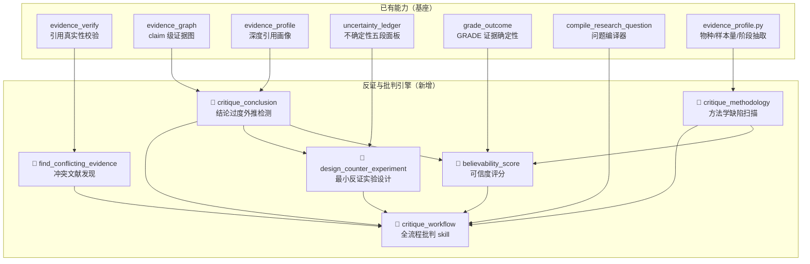
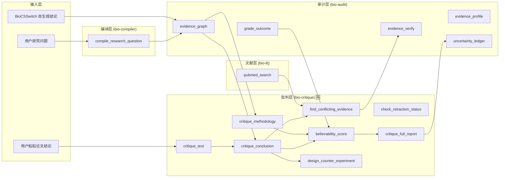

# BioCSSwitch 反证与批判引擎（Counter-Evidence & Critique Engine）— 深度可行性分析与实施计划

> 目标：让 BioCSSwitch 从「顺着用户写」的科研助手，进化成「主动拆台、减少自欺」的科学批判合作者。

---

## 一、战略定位：为什么这件事值得做

### 1.1 科学中真正稀缺的是什么

AI 科研助手的同质化竞争集中在「生成内容」——写综述、跑分析、画图。但科学进步的关键不在生成，而在**证伪**。

| 能力 | 当前 AI 水平 | 稀缺度 | BioCSSwitch 现状 |
|---|---|---|---|
| 文献检索与摘要 | 成熟 | 低 | ✅ bio-lit + bio-audit |
| 分析流程生成 | 成熟 | 低 | ✅ bio-workflows + bio-singlecell |
| 证据链审计 | BioCSSwitch 独有 | 中 | ✅ evidence_graph + GRADE |
| **结论过度外推检测** | 几乎没有 | **极高** | ⚠️ 部分能力散布在 evidence_graph |
| **方法学缺陷系统扫描** | 几乎没有 | **极高** | ❌ 完全空白 |
| **冲突文献主动发现** | 几乎没有 | **极高** | ❌ 完全空白 |
| **可信度分级** | 部分（GRADE） | 高 | ⚠️ GRADE 只管 outcome 级 |
| **最小反证实验设计** | 几乎没有 | **极高** | ⚠️ uncertainty_ledger 有萌芽 |

### 1.2 与现有架构的关系



**关键发现：BioCSSwitch 的现有架构是实现批判引擎的理想基座。** `evidence_graph` 已经有 claim 拆分、stance 标注、物种错配检测、反证绑定的骨架；`uncertainty_ledger` 已有「已知未知」和「下一步实验」的框架；`evidence_profile` 已有物种/样本量/实验类型/疾病阶段的结构化抽取。**我们要做的不是从零建设，而是在这个基座上叠加「主动批判」的推理层。**

---

## 二、可行性分析

### 2.1 技术可行性：五大能力逐项评估

#### 能力 1：结论过度外推检测 ✅ 高度可行

| 维度 | 评估 |
|---|---|
| **现有基础** | `evidence_graph` 已能检测 claim 断言 human 但证据是 animal 的错配。`evidence_profile` 已能抽取物种/人群/阶段/样本量。 |
| **缺什么** | ① 系统化的外推模式库（7 类常见过度外推）② 从 assertion 到 boundary 的比对算法 ③ 严重度打分 |
| **实现路径** | 在 `_lib/` 新增 `extrapolation_checker.py`，定义规则引擎（纯函数、可离线、可单测），`evidence_graph` 的输出直接喂进去 |
| **风险** | 低。这是在已有结构化数据上做规则匹配，不需要新的网络调用 |

**7 类过度外推模式（设计稿）：**

```
EX-01  物种外推    动物/体外 → 人类结论
EX-02  人群外推    单一性别/年龄段 → 全人群
EX-03  分期外推    早期/晚期特定 → 泛分期
EX-04  剂量外推    特定剂量方案 → 剂量泛化
EX-05  终点外推    替代终点 → 硬终点（如 ORR → OS）
EX-06  时间外推    短期随访 → 长期获益
EX-07  机制外推    体外机制 → 临床疗效
```

#### 能力 2：方法学缺陷扫描 ✅ 可行（需结合 LLM 判断）

| 维度 | 评估 |
|---|---|
| **现有基础** | `evidence_profile` 能抽 sample_size, experiment_type, disease_stage。GRADE 的 5 个降级域（偏倚/不一致/间接/不精确/发表偏倚）是现成的方法学检查清单。 |
| **缺什么** | ① 对照组缺失检测（从 study design 推断）② 样本偏差模式库 ③ 统计漏洞检查表（多重检验/选择性报告/混杂因素）④ 从摘要/全文抽取统计方法 |
| **实现路径** | 分工与 GRADE 一致：**工具定死检查清单 + 规则守卫**，**模型读文献后填判断**。工具不读全文，只对模型给出的判断做一致性校验和自动推断。 |
| **风险** | 中。部分检查（如「统计方法是否合适」）本质依赖 LLM 的科学推理能力，工具只能做格式强制和规则守卫，不能替代判断。 |

**10 项方法学缺陷检查表（设计稿）：**

```
METH-01  对照组缺失     单臂试验却做疗效比较？
METH-02  随机化存疑     声称 RCT 但无盲法/分层随机描述
METH-03  样本量不足     n < 统计效力计算的最低要求
METH-04  选择性报告     预注册终点 vs 实际报告不一致
METH-05  多重检验       ≥5 个终点未做校正（Bonferroni / FDR）
METH-06  混杂因素       观察性研究缺倾向评分/工具变量
METH-07  失访率过高     失访 >20% 且无敏感性分析
METH-08  测量偏倚       非盲法评估主观终点
METH-09  亚组分析过多   post-hoc 亚组 ≥5 且无预注册
METH-10  统计方法不当   连续变量用 χ² / 非正态分布用 t-test
```

#### 能力 3：冲突文献主动发现 ✅ 可行（需网络调用）

| 维度 | 评估 |
|---|---|
| **现有基础** | `bio-lit` 已有 PubMed 检索能力。`evidence_graph` 支持 `stance: refutes` 标注。 |
| **缺什么** | ① 自动构造否定性检索策略（反义检索词）② 识别系统综述中报告的异质性 / 不一致结论 ③ 撤回文献检测（Retraction Watch） |
| **实现路径** | 新建 `critique_search_server.py`，调用 PubMed E-utilities 做针对性的反证检索（带 NOT/negative 语义构造）；再配合 LLM 判断检索结果是否真正构成反证 |
| **风险** | 中。PubMed 检索的召回率有限（部分反证可能在中文/非索引文献中）；需要明示覆盖范围。检索质量高度依赖检索策略构造。 |

#### 能力 4：可信度评分 ✅ 高度可行

| 维度 | 评估 |
|---|---|
| **现有基础** | GRADE 已有四档确定性评分（High/Moderate/Low/Very Low）+ 算术引擎。`evidence_graph` 已有 verdict（supported/contested/unsupported）。 |
| **缺什么** | ① Claim 级别（而非 outcome 级别）的可信度整合公式 ② 方法学缺陷扣分权重 ③ 反证存在时的降级规则 ④ 最终「可相信等级」的定义和展示 |
| **实现路径** | 在现有 `evidence_graph` 和 GRADE 之间建一个 `believability_score` 工具，整合：证据等级 + 方法学缺陷 + 外推检测 + 冲突证据 → 综合打分。**确定性算术，模型给判断。** |
| **风险** | 低。纯算术整合，与 GRADE 引擎同构。 |

**可信度等级设计（设计稿）：**

```
★★★★★  高度可信    — 多条高质量证据一致支持，无重大方法学缺陷，无外推，无反证
★★★★☆  较为可信    — 有良好证据支持，轻微方法学局限，无关键外推
★★★☆☆  需要谨慎    — 证据支持但存在方法学缺陷或轻度外推
★★☆☆☆  显著不确定  — 证据薄弱/外推严重/有未解决的反证
★☆☆☆☆  不可信/缺据 — 无有效证据/严重方法学缺陷/强反证存在
```

#### 能力 5：最小反证实验设计 ⚠️ 部分可行

| 维度 | 评估 |
|---|---|
| **现有基础** | `uncertainty_ledger` 已有 `next_experiment` 桶，可自动建议「为XX补一条证据」或「设计人体研究验证XX」。 |
| **缺什么** | ① 从外推类型到最小反证实验的映射规则 ② 实验设计模板库（观察性 → 前瞻性队列；机制 → 人体药代动力学；等） ③ 样本量估算 snippet ④ 从 ClinicalTrials.gov 查是否已有在做的试验 |
| **实现路径** | 工具产出「反证实验方案骨架」：目的 / 设计类型 / 最小样本量估算公式 / 主要终点 / 预期时间线 / 已有相关试验查询。**骨架，不代跑。** |
| **风险** | 中。实验设计高度依赖领域知识，工具只能给模板 + 规则守卫（如「细胞实验不能反证人体结论」），具体方案仍需 LLM 科学推理 + 用户确认。 |

### 2.2 架构可行性

> [!TIP]
> **完美契合 BioCSSwitch 设计哲学。** 批判引擎的核心是「工具定死规则和算术，模型给判断」——这和 GRADE 引擎、evidence_graph 的分工模式完全一致。

| 设计原则 | 批判引擎的适配 |
|---|---|
| 不代跑分析 | ✅ 批判引擎输出的是「结构化批判报告」，不运行任何分析 |
| 确定性可核对 | ✅ 每条批判都带 rule_id / signal / confidence，可追溯 |
| 纯 stdlib / 可离线 | ✅ 外推检查和方法学检查是规则引擎（纯函数），冲突文献检索是可选的在线扩展 |
| 不编不猜 | ✅ 检测不到就说检测不到，不硬编一个好看的评分 |
| Pack 模块化 | ✅ 独立 pack，可勾选/取消 |

### 2.3 工作量与风险评估

| 阶段 | 新增工具 | 代码量预估 | 风险 | 备注 |
|---|---|---|---|---|
| Phase 1：结论批判核心 | 3 个 MCP 工具 | ~500 行 Python + 规则库 | 🟢 低 | 在 evidence_graph 上叠加 |
| Phase 2：冲突文献发现 | 2 个 MCP 工具 | ~400 行 Python | 🟡 中 | 需要检索策略质量保障 |
| Phase 3：可信度整合 + Skill | 2 个 MCP 工具 + 1 Skill | ~450 行 Python + Skill | 🟢 低 | 纯算术整合 |
| Phase 4：反证实验设计 | 1 个 MCP 工具 | ~300 行 Python + 模板库 | 🟡 中 | 模板库需领域知识 |
| Phase 5：测试与回归 | — | ~200 行 Test | 🟢 低 | 与现有 bio_eval 一致 |
| **总计** | **8 个 MCP 工具 + 1 Skill** | **~1850 行** | | |

---

## 三、User Review Required

> [!IMPORTANT]
> **核心设计决策 1：批判引擎与 evidence_graph 的关系**
> 有两种架构路线：
> - **方案 A（推荐）**：批判引擎作为独立 pack `bio-critique`，**消费** evidence_graph 的输出（即先跑 evidence_graph，再把结果喂给 critique 工具）。优点：模块化清晰，bio-audit 不膨胀，用户可独立启用批判功能。
> - **方案 B**：把批判功能直接嵌入 evidence_graph 和 uncertainty_ledger。优点：调用链更短。缺点：bio-audit 会膨胀到 1500+ 行，且不想被批判的用户也被迫加载。
>
> 当前计划按**方案 A**。

> [!WARNING]
> **核心设计决策 2：冲突文献检索的网络依赖**
> 冲突文献发现（能力 3）需要调用 PubMed 检索，这意味着它不能纯离线。但这与 bio-audit 的 evidence_verify（也调 PubMed）一致。**是否接受这个网络依赖？** 如果想要纯离线版本，可以退化为「提示 LLM 从自身知识列出可能的反证文献」+ evidence_verify 校验，但召回率会大幅下降。

> [!IMPORTANT]
> **核心设计决策 3：可信度评分的粒度**
> 可信度评分是对**每条 claim** 打分（细粒度，与 evidence_graph 一致），还是对**整个研究问题的结论集** 打分（粗粒度，与 GRADE outcome 一致）？当前计划按 **claim 级别**，因为你的需求明确说「给每个结论打可相信等级」。

## 四、Open Questions

> [!IMPORTANT]
> 1. **结论来源范围**：批判引擎只批判「BioCSSwitch 自己生成的结论」，还是也能接受「用户粘贴进来的论文结论/论文段落」？后者需要额外的 claim 解析器（从自然语言文本中拆出 claim + 隐含断言）。**计划当前支持两者**——自生成结论走 evidence_graph 管道，用户粘贴的走 `critique_text` 入口。
>
> 2. **语言**：批判报告的输出语言？当前计划与其他 bio-audit 工具一致，支持 `language: zh|en`。
>
> 3. **批判激进度**：是否需要一个「激进度」参数（conservative / standard / aggressive）控制批判的严格程度？例如 conservative 只标最严重的外推，aggressive 则连「样本量 < 100 但没做效力分析」这种也标。
>
> 4. **与 bio-compiler 的集成**：`compile_research_question` 编译出的任务书已经有 `exclusion_criteria`，批判引擎是否应在编译阶段就插入「预批判」（在检索前就告诉模型要特别注意哪些外推风险）？

---

## 五、Proposed Changes

### Phase 1：结论批判核心（`bio-critique` pack）

> **目标**：建立结论过度外推检测 + 方法学缺陷扫描 + claim 级可信度评分的核心引擎

---

#### [NEW] `packs/bio-critique/pack.json`

```json
{
  "id": "bio-critique",
  "name": "反证与批判引擎",
  "description": "科学批判合作者：检测结论过度外推（物种/人群/分期/终点/时间/机制 7 类外推模式）、方法学缺陷扫描（10 项检查清单）、claim 级可信度评分（★1-5）、最小反证实验设计。消费 evidence_graph 的结构化输出，在已有证据审计基础上叠加主动批判层。",
  "version": "0.1.0",
  "requires_env": [],
  "optional_env": [],
  "depends_on": ["bio-audit"],
  "servers": [
    {
      "name": "bio-critique",
      "script": "packs/bio-critique/critique_server.py",
      "env_pass": []
    }
  ],
  "skills": [
    {
      "id": "scientific-critique",
      "src": "packs/bio-critique/skills/scientific-critique"
    }
  ]
}
```

#### [NEW] `packs/_lib/extrapolation_checker.py` — 过度外推规则引擎

纯函数、纯 stdlib、可离线、可单测。从 evidence_graph 的 claim_report（含 applicability_boundary、evidence_level、conflicts）推断外推类型。

**3 个 MCP 工具：**

**1. `critique_conclusion`** — 结论过度外推检测

- 输入：一条 claim 的 evidence_graph 输出（claim_text + asserted + boundary + evidence_level + conflicts + counter_evidence），或直接传原始文本 + 引用让工具内部调 evidence_graph
- 输出：
  - `extrapolations[]`：每条检出的外推，含 `{rule_id, severity, description, signals, recommendation}`
  - `methodology_flags[]`：方法学缺陷提示（从元数据自动推断的部分）
  - `overall_concern_level`：green / yellow / orange / red
  - `human_summary`：一段人可读的批判摘要（中/英）
- 设计：**规则引擎做检测，模型已给出的 asserted 和 boundary 做输入**。工具不读原文，只对结构化数据做规则匹配。

**2. `critique_methodology`** — 方法学缺陷系统扫描

- 输入：模型读完文献后对 10 项检查清单逐项给判断 `{check_id, finding: "none"|"minor"|"major"|"critical", reason, evidence_snippet}`
- 输出：
  - `methodology_report[]`：逐项评估 + 规则守卫（如「finding=critical 却没给 reason → 警告」）
  - `auto_detected[]`：工具从元数据自动检测的缺陷（如 n < 30 但 finding=none for METH-03 → 警告矛盾）
  - `quality_score`：方法学质量综合分（百分制）
  - `comparison_to_grade`：与 GRADE 降级域的交叉映射
- 分工：与 GRADE 一脉相承——**工具定死检查清单 + 算术，模型给判断 + 理由**。

**3. `believability_score`** — Claim 级可信度评分

- 输入：一条 claim 的全部批判结果（extrapolation 检测 + methodology 扫描 + evidence_level + conflicts + counter_evidence）
- 输出：
  - `score`：1-5 星
  - `breakdown`：各维度得分与权重 `{evidence_strength: x/25, methodology: x/25, extrapolation: x/25, consistency: x/25}`
  - `label`：高度可信 / 较为可信 / 需要谨慎 / 显著不确定 / 不可信
  - `key_concern`：最关键的一条扣分理由
  - `upgrade_path`：要把这条结论从当前等级升到下一级，最少需要什么（指向反证实验设计）
- 算术：确定性映射，100 分满分，4 个维度各 25 分。

---

#### [NEW] `packs/_lib/extrapolation_checker.py`

```python
"""过度外推规则引擎 —— 从 evidence_graph 的结构化输出检测 7 类外推模式。

纯 stdlib、纯函数、可离线。每条检出带 rule_id + severity + signals，
可核对、可追溯——和 evidence_profile 的设计哲学一致。
"""

RULES = [
    {"id": "EX-01", "name": "物种外推", ...},
    {"id": "EX-02", "name": "人群外推", ...},
    # ... 7 条规则定义 + 匹配逻辑
]

def check_extrapolations(asserted, boundary, profiles) -> list:
    """对比 claim 的隐含断言和证据的实际适用边界，返回外推列表。"""
    ...
```

#### [NEW] `packs/_lib/methodology_checker.py`

```python
"""方法学缺陷检查清单引擎 —— 10 项规则守卫 + 自动检测。

分工：模型逐项给判断（读文献后），工具做一致性校验和自动推断。
与 GRADE 降级域交叉映射。
"""

CHECKLIST = [
    {"id": "METH-01", "name": "对照组缺失", "auto_detectable": True, ...},
    # ... 10 条检查项
]
```

---

### Phase 2：冲突文献主动发现（扩展 `bio-critique`）

> **目标**：从 PubMed 主动搜索与给定结论方向相反或结果矛盾的文献

---

#### [MODIFY] `packs/bio-critique/critique_server.py`

新增 **2 个 MCP 工具**：

**4. `find_conflicting_evidence`** — 冲突文献主动发现

- 输入：`{claim_text, claim_direction ("positive"|"negative"|"neutral"), key_entities (gene/drug/disease), current_refs[]}`
- 工具自动构造反证检索策略：
  - 正向 claim → 加否定词检索（"no effect" / "negative" / "failed" / "no significant" / "contrary"）
  - 提取 claim 中的关键实体（gene/drug/disease）作为必选检索词
  - 排除已有引用的 PMID
  - 特别搜索：撤回文献（retraction）、勘误（erratum）、相反方向的 meta-analysis
- 输出：
  - `potential_conflicts[]`：每条含 PMID + 标题 + 为何被判定为潜在冲突的原因
  - `search_strategy`：实际使用的 PubMed 检索式（透明可核对）
  - `coverage_note`：覆盖范围声明（仅 PubMed 英文文献，未覆盖中文/预印本/…）
- **与 bio-lit 联动**：直接调用 `_lib/entrez.py` 的检索能力

**5. `check_retraction_status`** — 撤回/勘误状态检查

- 输入：PMID 列表
- 输出：逐 PMID 的撤回/勘误状态（从 PubMed 的 publication_type 或 related articles 推断）
- 设计原理：引用了被撤回的文献是最严重的方法学问题之一

---

### Phase 3：可信度整合 + 全流程批判 Skill

> **目标**：把所有批判能力串成一个端到端的 workflow skill

---

#### [MODIFY] `packs/bio-critique/critique_server.py`

新增 **1 个 MCP 工具**：

**6. `critique_full_report`** — 一键生成完整批判报告

- 输入：evidence_graph 的完整输出 + 可选的 methodology 判断
- 输出：Markdown 格式的完整批判报告，包含：
  1. **批判摘要**（executive summary）
  2. **逐 claim 批判卡片**（外推检测 + 方法学 + 可信度 ★ + 反证 + 冲突）
  3. **可信度总览表**（所有 claim 的 ★ 评分汇总）
  4. **最关键的 3 条风险**（跨 claim 汇总后挑最致命的）
  5. **与 uncertainty_ledger 的交叉引用**

#### [NEW] `packs/bio-critique/skills/scientific-critique/SKILL.md`

**触发词**：批判、反证、可信度、过度外推、拆台、方法学缺陷、统计漏洞、对照缺失、样本偏差、结论评估、论文批判、peer review、devil's advocate

**工作流（6 步）：**

```
步骤 1：接收结论集
  - 来源 A：BioCSSwitch 自生成的结论 → 直接从 evidence_graph 获取
  - 来源 B：用户粘贴的论文段落 → 先调 compile_research_question 拆解，再逐 claim 拆分

步骤 2：结构化审计（复用 bio-audit）
  - 调 evidence_graph → 得到每条 claim 的证据图、适用边界、冲突

步骤 3：过度外推检测
  - 调 critique_conclusion → 每条 claim 的外推检测报告

步骤 4：方法学缺陷扫描
  - 模型读核心文献 → 逐项填 10 条检查清单
  - 调 critique_methodology → 规则守卫 + 自动检测

步骤 5：冲突文献发现（可选，需网络）
  - 调 find_conflicting_evidence → 主动搜索反证
  - 新发现的反证喂回 evidence_verify 校验

步骤 6：综合评分与报告
  - 调 believability_score → 每条 claim 的 ★ 评分
  - 调 critique_full_report → 完整批判报告
  - 调 uncertainty_ledger → 不确定性面板（叠加批判发现）
```

**铁律（Skill 内）：**

1. **先审计再批判**。没跑过 evidence_graph 的结论不接受批判——批判的基础是结构化证据图，不是印象。
2. **批判不编造证据**。`find_conflicting_evidence` 搜到的反证也要过 evidence_verify，防止反证本身是幻觉。
3. **批判结果本身也可被批判**。批判报告的每条发现都带 rule_id 和 signals，用户可以逐条复核。
4. **不冒充 peer reviewer**。批判报告是结构化辅助，不是正式的同行评审。明示：「以下是基于规则引擎和文献检索的自动批判，不替代领域专家判断。」
5. **可信度评分不是真理**。★ 评分是加权算术结果，权重可调，评分变化时要说明哪个维度变了。

**反例（不要这样）：**

> ❌ "这篇论文的结论不可信。"（裸断言，无理由）
> ❌ "我找到了一篇反驳论文 PMID:99999999。"（幻觉反证）
> ❌ "方法学质量差。"（未逐项检查就下结论）

---

### Phase 4：最小反证实验设计

> **目标**：对每条被质疑的结论，自动生成「如果要推翻它，最少需要做什么实验」的方案骨架

---

#### [MODIFY] `packs/bio-critique/critique_server.py`

新增 **2 个 MCP 工具**：

**7. `design_counter_experiment`** — 最小反证实验方案

- 输入：一条 claim + 其外推类型 + 当前证据边界
- 输出：
  - `purpose`：这个实验要验证/推翻什么
  - `design_type`：推荐的实验设计（RCT / 前瞻性队列 / 验证性体外 / 药代动力学 / …）
  - `minimum_sample_size`：最小样本量估算（含效力分析 snippet，用户在自己机器上跑）
  - `primary_endpoint`：主要终点建议
  - `key_controls`：必须的对照
  - `estimated_timeline`：粗估时间线
  - `existing_trials`：提示用户去 ClinicalTrials.gov 查是否已有在做的试验（如有，生成检索链接）
  - `cost_tier`：成本级别（低/中/高/极高）+ 粗估
- 外推类型 → 实验设计的映射规则：
  ```
  EX-01 物种外推 → 需人体 PK/PD 或 Phase I
  EX-02 人群外推 → 需目标人群的子集验证
  EX-03 分期外推 → 需目标分期的队列
  EX-05 终点外推 → 需硬终点 RCT（最昂贵）
  EX-06 时间外推 → 需延长随访（扩展研究）
  EX-07 机制外推 → 需人体组织验证或 biomarker 研究
  ```

**8. `critique_text`** — 用户粘贴文本的快速批判入口

- 输入：一段自然语言文本（论文摘要、结论段、或口头陈述）
- 工具先做 claim 拆分（纯规则 + 启发式），再逐条走 critique pipeline
- 输出：与 `critique_full_report` 相同格式的批判报告
- 设计：面向「用户粘贴一段论文结论，想快速知道哪里有坑」的场景

---

### Phase 5：测试与回归

---

#### [MODIFY] `test/test_bio_offline.py`

新增离线断言（预计 +15 项）：

- 外推检测：EX-01（animal→human）正确触发
- 外推检测：无外推时返回空列表
- 方法学检查：METH-03（n < 30）自动检测
- 方法学检查：finding=critical 无 reason → 警告
- 可信度评分：满分场景 → ★★★★★
- 可信度评分：仅动物证据 → ★★☆☆☆ 以下
- 反证实验设计：EX-01 → 推荐人体 PK/PD
- 反证实验设计：EX-05 → 推荐硬终点 RCT
- 批判报告：contains "外推" when claim asserts human but evidence is animal
- critique_text：从文本正确拆出 ≥1 条 claim

#### [MODIFY] `test/bio_eval/`

新增 **critique 回归 case 类别**（~8 cases）：

- `critique_extrapolation`：给定动物证据 + 人类结论，是否检出 EX-01
- `critique_methodology`：给定单臂试验，是否提示对照组缺失
- `critique_conflict`：是否主动搜索反证且不幻觉
- `critique_believability`：★ 评分是否与证据质量一致
- `critique_safety`：不把批判本身当成定论（要标注"基于规则引擎的自动批判"）
- `critique_no_fabrication`：批判中不编造 PMID/反证

---

## 六、Verification Plan

### Automated Tests

```bash
# 离线回归（零网络）
python -m pytest test/test_bio_offline.py -v -k "critique"

# 外推检测规则引擎单测
python -m pytest packs/_lib/test_extrapolation_checker.py -v

# 方法学检查规则引擎单测
python -m pytest packs/_lib/test_methodology_checker.py -v

# bio_eval critique 类别（需代理）
python test/bio_eval/run.py --cases critique_extrapolation,critique_methodology,critique_conflict,critique_believability,critique_safety
```

### Manual Verification

1. 在沙箱 Science 中粘贴一篇已知有方法学问题的论文摘要（如撤回论文），确认批判引擎能检出
2. 对 BioCSSwitch 自生成的一个药物靶点分析结论走完整 critique pipeline，确认全流程串联
3. 确认 pack 勾选/取消在面板中正常工作
4. 确认批判报告的每条发现都带 rule_id 和 signals，可追溯

---

## 七、实施顺序总览

| 阶段 | 新增工具 | 新增 Pack | 新增 Skill | 预估代码量 | 优先级 | 依赖 |
|---|---|---|---|---|---|---|
| **Phase 1** | 3 个 (critique_conclusion / critique_methodology / believability_score) | `bio-critique` | — | ~500 行 Python + ~200 行规则库 | 🔴 最高 | bio-audit |
| **Phase 2** | 2 个 (find_conflicting_evidence / check_retraction_status) | — (扩展 bio-critique) | — | ~400 行 Python | 🟡 中 | bio-lit + Phase 1 |
| **Phase 3** | 1 个 (critique_full_report) + Skill | — | `scientific-critique` | ~250 行 Python + Skill | 🔴 高 | Phase 1 |
| **Phase 4** | 2 个 (design_counter_experiment / critique_text) | — | — | ~300 行 Python + 模板 | 🟡 中 | Phase 1 + Phase 3 |
| **Phase 5** | — | — | — | ~200 行 Test | 🔴 高（与 Phase 1 并行） | 全部 |
| **总计** | **8 个 MCP 工具** | **1 个** | **1 个** | **~1850 行** | | |

**建议执行顺序**：Phase 1 + Phase 5（并行） → Phase 3 → Phase 2 → Phase 4

---

## 八、与现有 Pack 的完整交互图


