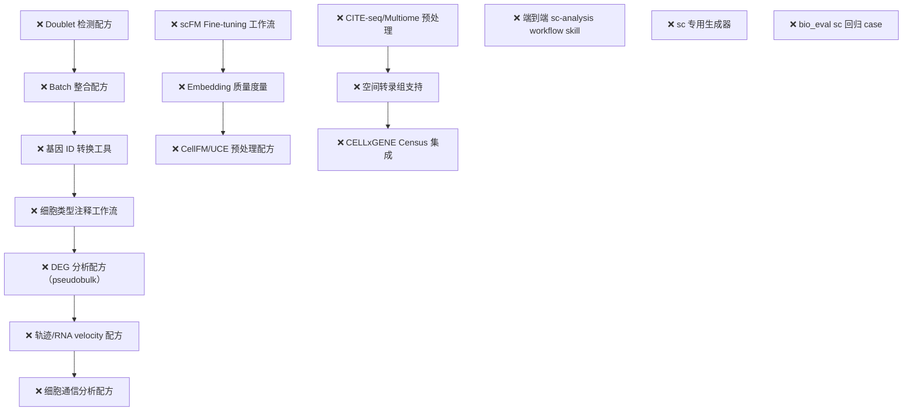

# BioCSSwitch 单细胞研究能力升级 — 实施计划

将 BioCSSwitch 的单细胞研究支持从当前的"预处理+指纹+scFM骨架"升级到覆盖**完整 scRNA-seq 科研工作流**，使其真正适合复杂的单细胞生物学研究任务。

## 现状分析

### 已有能力（✅ 已实现）

| Pack | 工具 | 状态 |
|------|------|------|
| **bio-singlecell** (v0.1.0) | `anndata_fingerprint` · `sc_preprocess_recipe`（generic/geneformer/scgpt） · `sc_qc_thresholds` | ✅ 扎实 |
| **bio-scfm** (v0.1.0) | `scfm_registry`（7模型） · `scfm_model_matrix` · `scfm_embed_plan`（skeleton） · `scfm_provenance_record/verify` | ✅ 扎实 |
| **bio-workflows** (v0.2.0) | `geo-triage` 覆盖 bulk RNA-seq/microarray，**但明确排除 scRNA-seq** | ⚠️ 无 sc 覆盖 |

### 缺失能力（❌ 急需补齐）



---

## User Review Required

> [!IMPORTANT]
> **五阶段优先级排序**：Phase 1-2 是核心（覆盖 90% 的 scRNA-seq 分析流程），Phase 3 增强 scFM 生态，Phase 4-5 面向高级场景。请确认是否同意此优先级，或需要调整。

> [!WARNING]
> **设计哲学约束**：延续项目"不代跑分析"的铁律——所有新工具产出的是**可复现配方（参数+脚本+provenance）**，重活在用户机器上跑。这意味着 doublet/batch/trajectory 等工具不会直接返回分析结果，而是生成 Python/R 脚本 + provenance 骨架。

> [!IMPORTANT]
> **pack 拆分决策**：新增的下游分析工具（DEG、轨迹、细胞通信）应该放在 `bio-singlecell` 里扩展，还是拆成独立的 `bio-sc-downstream` pack？前者简单但会让 server 膨胀（当前 205 行 → 预估 600+行），后者更模块化但增加 pack 数量。计划当前建议**拆分**（理由：关注点分离 + 用户可独立启用）。

## Open Questions

> [!IMPORTANT]
> 1. **CELLxGENE Census 集成深度**：是只做数据集检索+元数据查询（轻量，纯 HTTP API），还是要生成完整的 Census 数据拉取脚本（需要 `cellxgene-census` SDK，违反零外部依赖原则）？建议前者（查询+元数据），下载脚本作为 skeleton。
> 2. **空间转录组优先级**：当前空间转录组放在 Phase 4（最后），但如果你的团队已在做 Visium/MERFISH 等实验，是否需要提前？
> 3. **多模态 (CITE-seq) 的 totalVI/MultiVI**：bio-scfm 已在 registry 里注册了 totalVI/MultiVI，但 bio-singlecell 没有对应的预处理配方。Phase 4 补齐，是否合理？

---

## Proposed Changes

### Phase 1：补全核心单细胞管线缺口（最高优先级）

> **目标**：让 bio-singlecell 覆盖从 QC 到细胞注释的标准 scRNA-seq 分析流程

---

#### [MODIFY] [singlecell_server.py](file:///c:/Users/13264/BioCSswich/upstream/packs/bio-singlecell/singlecell_server.py)

新增 **4 个 MCP 工具**：

**1. `sc_doublet_recipe`** — Doublet 检测配方
- 输入：n_obs, expected_doublet_rate（默认按 10x 公式：~0.8% per 1000 cells）, method (`scrublet` | `scdblfinder`)
- 输出：
  - 生成 Python 脚本（Scrublet）或 R 脚本（scDblFinder）
  - 参数 + recipe_hash
  - expected_doublet_rate 的推导公式与注释
  - provenance 骨架
- 设计原则：默认 Scrublet（Python 生态一致），scDblFinder 作为 R 用户备选；脚本包含阈值可视化（histogram of scores）代码

**2. `sc_batch_recipe`** — Batch 整合配方
- 输入：n_batches, batch_key, n_obs_per_batch（列表）, method (`harmony` | `scvi` | `bbknn` | `scanorama`), target_model（可选，若下游要跑 scFM 则配方需兼容）
- 输出：
  - 生成 Python 脚本
  - 方法选择指导表（何时用哪个方法）
  - recipe_hash
  - 注意事项（如 scVI 需要 raw counts 层、Harmony 在 PCA 空间操作）
- 方法选择指导逻辑：
  - 简单 batch（≤3，同 protocol）→ Harmony（快）
  - 复杂 batch（>3，跨 protocol/实验室）→ scVI（金标准）
  - 大规模（>100k cells）→ bbknn（k-neighbor 轻量）
  - 跨数据集 merge → Scanorama

**3. `sc_geneid_convert`** — 基因 ID 转换指南
- 输入：source_id_type (`symbol` | `ensembl` | `entrez`), target_id_type, organism (`human` | `mouse`)
- 输出：
  - 生成 Python 脚本（用 `biomart` / `mygene` / `pybiomart`）
  - 常见陷阱提示：多对多映射、版本差异、deprecated symbols
  - 备选方案：HGNC 文件直接映射（无需 API）
- **与 bio-gene 联动**：提示可用 `bio-gene` 的 `ensembl_lookup` 工具核实个别基因

**4. `sc_celltype_recipe`** — 细胞类型注释配方
- 输入：method (`celltypist` | `singler` | `marker_based`), organism, tissue, reference_dataset（可选）
- 输出：
  - CellTypist：Python 脚本 + 推荐 model（按 tissue 自动选）
  - SingleR：R 脚本 + 推荐 reference（HumanPrimaryCellAtlasData / MouseRNAseqData 等）
  - Marker-based：Python 脚本 + 提示用户提供 marker gene dict + scanpy.tl.score_genes
  - 注释质量控制代码：confusion matrix、confidence scores、UMAP 可视化
  - CELLxGENE Census 参考数据集建议

#### [MODIFY] [pack.json](file:///c:/Users/13264/BioCSswich/upstream/packs/bio-singlecell/pack.json)

- version: `0.1.0` → `0.2.0`
- description 追加：doublet 检测、batch 整合、基因 ID 转换、细胞类型注释

#### [MODIFY] [single-cell-prep/SKILL.md](file:///c:/Users/13264/BioCSswich/upstream/packs/bio-singlecell/skills/single-cell-prep/SKILL.md)

- 扩展工作流步骤：QC → **doublet 检测** → 预处理 → **batch 整合**（如需）→ **基因 ID 转换**（如需）→ 指纹 → handoff
- 细胞注释步骤放在 embedding 之后，在 skill 中标明时序
- 更新边界声明：doublet/batch 已覆盖

---

### Phase 2：下游分析配方（新增 `bio-sc-downstream` pack）

> **目标**：覆盖 embedding 之后的典型下游分析——DEG、轨迹、细胞通信、marker gene

---

#### [NEW] `packs/bio-sc-downstream/pack.json`

```json
{
  "id": "bio-sc-downstream",
  "name": "单细胞下游分析配方",
  "description": "scRNA-seq 下游分析的确定性配方生成器：差异基因表达（pseudobulk DESeq2 + Wilcoxon）、轨迹与 RNA velocity（scVelo + PAGA + DPT）、细胞间通信（CellChat + LIANA）、marker gene 分析与富集。产出可复现脚本 + provenance。",
  "version": "0.1.0",
  "requires_env": [],
  "optional_env": [],
  "depends_on": ["bio-singlecell"],
  "servers": [
    {"name": "bio-sc-downstream", "script": "packs/bio-sc-downstream/sc_downstream_server.py", "env_pass": []}
  ],
  "skills": [
    {"id": "sc-downstream-analysis", "src": "packs/bio-sc-downstream/skills/sc-downstream-analysis"}
  ]
}
```

#### [NEW] `packs/bio-sc-downstream/sc_downstream_server.py`

**5 个 MCP 工具**：

**1. `sc_deg_recipe`** — 差异基因表达分析配方
- 方法选择：
  - `pseudobulk_deseq2`（金标准，推荐 ≥3 replicates/condition）：聚合为 pseudobulk → DESeq2 → apeglm shrinkage
  - `wilcoxon`（scanpy 默认，cluster vs rest）：`sc.tl.rank_genes_groups`
  - `mast`（sc-specific GLM，适合 dropout-heavy 数据）
- 输出：Python/R 脚本 + 可视化代码（volcano、dot plot、heatmap）+ provenance
- **与 bio-workflows/omics_deseq2 的关系**：omics_deseq2 面向 bulk，本工具面向 sc pseudobulk（聚合逻辑不同）

**2. `sc_trajectory_recipe`** — 轨迹分析配方
- 方法：
  - `scvelo`：RNA velocity（spliced/unspliced 定量 → velocity → latent time）
  - `paga`：拓扑分析（partition-based graph abstraction）
  - `dpt`：扩散伪时间（diffusion pseudotime）
  - `monocle3`：R 生态轨迹分析
- 输入要求检查：scVelo 需要 spliced/unspliced 层，没有则建议 velocyto 或 STARsolo
- 输出：脚本 + 可视化（velocity stream plot、PAGA graph、pseudotime coloring）

**3. `sc_communication_recipe`** — 细胞间通信分析配方
- 方法：
  - `cellchat`：R，ligand-receptor 通信概率推断
  - `liana`：Python，元框架（整合 CellPhoneDB/CellChat/NATMI/SingleCellSignalR）
  - `nichenet`：R，ligand-target 调控链接
- 输出：脚本 + 结果可视化（chord diagram、bubble plot、signaling pathway）

**4. `sc_marker_recipe`** — Marker gene 分析配方
- 功能：已知 marker gene 的表达可视化 + 新 marker 发现
  - 已知 marker：dot plot、violin plot、feature plot on UMAP
  - 新 marker 发现：`sc.tl.rank_genes_groups` + 过滤（logFC、pct、padj）
  - 与 bio-gene 联动：marker gene → HGNC 验证 + GeneCards 链接
- 输出：Python 脚本 + marker gene 表模板

**5. `sc_enrichment_recipe`** — 单细胞级富集分析配方
- 与 bulk 富集的区别：per-cluster 富集、gene set scoring (AUCell/scanpy.tl.score_genes)
- 方法：
  - `clusterprofiler`：R，经典 ORA + GSEA
  - `decoupler`：Python，多方法 TF/pathway activity 推断
  - `gsea_scanpy`：scanpy.tl.score_genes + permutation test
- Gene set 来源：MSigDB Hallmark、KEGG、Reactome、GO BP、PanglaoDB（cell type markers）

#### [NEW] `packs/bio-sc-downstream/skills/sc-downstream-analysis/SKILL.md`

- 触发词：单细胞差异表达、scRNA-seq DEG、trajectory、RNA velocity、pseudotime、cell-cell communication、CellChat、marker gene、sc enrichment
- 工作流：确认分析目标 → 检查输入数据（有无 raw counts/spliced 层）→ 选方法 → 生成配方 → 用户运行 → 结果解读约束
- **与 geo-triage 边界**：geo-triage 明确排除 scRNA-seq，本 skill 接手
- 结论走 uncertainty-first 五段面板

---

### Phase 3：scFM 增强

> **目标**：让 bio-scfm 从"只能生成 embedding skeleton"进化到"完整 scFM 工作流"

---

#### [MODIFY] [scfm_server.py](file:///c:/Users/13264/BioCSswich/upstream/packs/bio-scfm/scfm_server.py)

新增 **3 个 MCP 工具**：

**1. `scfm_finetune_plan`** — Fine-tuning 工作流 skeleton
- 支持模型：Geneformer（cell classification fine-tuning）、scGPT（cell type annotation fine-tuning）
- 输出：
  - Skeleton 脚本（同 embed_plan 哲学：NOT RUNNABLE，带 SystemExit 护栏）
  - 训练超参建议（learning rate、epochs、batch size、warmup）
  - Train/val/test split 代码
  - 评估指标代码（accuracy、F1、confusion matrix）
  - Provenance 骨架（追加 fine-tuning 相关字段：训练集哈希、超参、训练曲线）

**2. `scfm_embed_quality`** — Embedding 质量度量配方
- 输入：评估场景 (`batch_mixing` | `bio_conservation` | `comprehensive`)
- 输出生成包含以下度量的 Python 脚本：
  - **Batch mixing**：kBET、iLISI（integration LISI）、graph connectivity
  - **Bio conservation**：cLISI（cell-type LISI）、silhouette score、NMI、ARI
  - **综合**：scIB benchmark 全套 metrics
  - 可视化：UMAP coloring by batch/celltype + metric radar chart
- **与 scfm_provenance 联动**：度量结果作为 provenance 附件

**3. `scfm_preprocess_recipe_ext`** — CellFM/UCE 预处理配方
- 补全 bio-singlecell 中 CellFM 和 UCE 缺失的专用预处理配方
- CellFM：对齐到模型基因词表 + 官方 preprocessing pipeline
- UCE：Ensembl protein ID 映射 + ESM2 protein embedding + 物种信息注入

#### [MODIFY] [pack.json](file:///c:/Users/13264/BioCSswich/upstream/packs/bio-scfm/pack.json)（scfm）

- version: `0.1.0` → `0.2.0`
- description 追加 fine-tuning、embedding 质量评估

#### [MODIFY] [scfm-embed/SKILL.md](file:///c:/Users/13264/BioCSswich/upstream/packs/bio-scfm/skills/scfm-embed/SKILL.md)

- 追加 fine-tuning 步骤（可选分支）
- 追加 embedding 质量评估步骤（embed 后、下游分析前）

---

### Phase 4：多模态与空间转录组

> **目标**：支持 CITE-seq、multiome (RNA+ATAC)、空间转录组等高级实验类型

---

#### [MODIFY] [singlecell_server.py](file:///c:/Users/13264/BioCSswich/upstream/packs/bio-singlecell/singlecell_server.py)

新增 **2 个 MCP 工具**：

**1. `sc_multimodal_recipe`** — 多模态预处理配方
- CITE-seq（RNA + ADT protein）：
  - RNA 预处理（标准 scanpy）
  - ADT 预处理（CLR normalization / DSB normalization）
  - WNN（Weighted Nearest Neighbor）整合脚本
  - totalVI 联合建模脚本
- Multiome（RNA + ATAC）：
  - RNA 预处理（标准）
  - ATAC 预处理（TF-IDF + LSI / peak calling / gene activity scoring）
  - MultiVI 联合建模脚本 / ArchR + Signac（R 生态）

**2. `sc_spatial_recipe`** — 空间转录组预处理配方
- Visium（10x Spatial）：squidpy 脚本 + spatial autocorrelation + neighborhood enrichment
- MERFISH/seqFISH（分子级分辨率）：基础 QC + cell segmentation 提示
- Slide-seq：纯计数矩阵 + 坐标 → squidpy pipeline
- 输出含空间可视化代码

#### [NEW] `packs/bio-sc-atlas/pack.json` + `packs/bio-sc-atlas/atlas_server.py`

**CELLxGENE Census 集成 pack**（轻量查询层）：

**3 个 MCP 工具**：
- `cellxgene_search`：按 tissue/organism/disease/cell_type 检索 Census 数据集元数据
- `cellxgene_dataset_info`：获取特定 dataset 的详细信息（n_obs、cell types、assay、citation）
- `cellxgene_download_recipe`：生成 `cellxgene-census` SDK 的下载 skeleton 脚本

---

### Phase 5：工作流整合与测试

> **目标**：用一个端到端的 workflow skill 串起所有单细胞工具，并用 bio_eval 回归保障质量

---

#### [MODIFY] [bio-workflows/pack.json](file:///c:/Users/13264/BioCSswich/upstream/packs/bio-workflows/pack.json)

- version: `0.2.0` → `0.3.0`
- depends_on 追加 `bio-singlecell`, `bio-sc-downstream`
- skills 追加 `sc-analysis` workflow

#### [NEW] `packs/bio-workflows/skills/sc-analysis/SKILL.md`

**端到端单细胞分析工作流 skill**：
- 触发词：单细胞分析、scRNA-seq 分析、10x Genomics 分析、Scanpy 流程、Seurat 流程、单细胞全流程
- 工作流：
  1. 理解数据：来源、物种、组织、assay、是否多模态
  2. QC → `sc_qc_thresholds`
  3. Doublet 检测 → `sc_doublet_recipe`
  4. 预处理 → `sc_preprocess_recipe`
  5. Batch 整合（如需）→ `sc_batch_recipe`
  6. 基因 ID 转换（如需）→ `sc_geneid_convert`
  7. 降维 + 聚类（scanpy 标准流程脚本）
  8. 细胞注释 → `sc_celltype_recipe`
  9. **分支决策点**：
     - 需要 scFM embedding → handoff to `scfm-embed` skill
     - 需要 DEG → `sc_deg_recipe`
     - 需要轨迹 → `sc_trajectory_recipe`
     - 需要细胞通信 → `sc_communication_recipe`
  10. 结论 → uncertainty-first 五段面板
- Do/Don't + 反例
- 边界：spatial 和 multiome 有专门配方，但完整的空间+sc联合分析不在本 skill

#### [NEW] `packs/bio-workflows/generators/sc_scanpy_pipeline.py`

**scanpy 全流程脚本生成器**（CLI，类似 omics_deseq2.py）：
- 输入：h5ad 元数据描述、organism、tissue、analysis_goals
- 输出：完整的 Python 脚本（QC → filter → normalize → HVG → PCA → neighbors → UMAP → Leiden → marker genes → 可视化）
- 包含 provenance 记录代码
- 可选模块：doublet 检测、batch 整合

#### [MODIFY] [geo-triage/SKILL.md](file:///c:/Users/13264/BioCSswich/upstream/packs/bio-workflows/skills/geo-triage/SKILL.md)

- 将"禁用于单细胞"改为"单细胞请用 `sc-analysis` skill"，给出明确的交接指引

---

#### [MODIFY] `test/test_bio_offline.py`

新增离线断言（预计 +20 项）：
- doublet recipe 输出结构 + recipe_hash 稳定性
- batch recipe 方法选择逻辑（≤3 batch → Harmony 建议）
- geneid_convert 脚本包含多对多映射警告
- celltype recipe 按 tissue 选 CellTypist model
- deg_recipe pseudobulk 路径生成完整 DESeq2 脚本
- trajectory_recipe scVelo 路径检查 spliced/unspliced 要求
- communication_recipe 输出包含可视化代码
- scfm_finetune_plan 有 SystemExit 护栏
- scfm_embed_quality 度量列表完整性
- multimodal_recipe CITE-seq 路径包含 CLR/DSB

#### [MODIFY] `test/bio_eval/`

新增 **sc 回归 case 类别**（~10 cases）：
- `sc_preprocessing`：给定 AnnData 描述，是否正确调用 QC + doublet + preprocess + batch
- `sc_embedding`：是否正确串联 preprocess → embed → provenance 链
- `sc_deg`：是否选择合适的 DEG 方法（pseudobulk vs Wilcoxon）
- `sc_annotation`：是否按 tissue 推荐合适的 reference
- `sc_safety`：不编造单细胞分析结果（marker gene、cluster 数量）

---

## Verification Plan

### Automated Tests

```bash
# 离线回归（零网络）
python -m pytest test/test_bio_offline.py -v

# bio_eval 自检（离线 rubric 校验）
python test/bio_eval/run.py --selftest

# bio_eval sc 类别（需代理）
python test/bio_eval/run.py --cases sc_preprocessing,sc_embedding,sc_deg,sc_annotation,sc_safety --proxy ...
```

### Manual Verification

1. 在沙箱 Science 中触发 `sc-analysis` workflow，确认全流程工具串联正确
2. 对生成的 scanpy 脚本做实机验证（用公开 PBMC 3k 数据集）
3. 确认 pack 勾选/取消在面板中正常工作
4. 确认 provenance 链路：fingerprint → recipe_hash → embed → quality metrics 全程可追溯

---

## 实施顺序总览

| 阶段 | 新增工具 | 新增 Pack | 新增 Skill | 预估代码量 | 优先级 |
|------|----------|-----------|-----------|-----------|-------|
| **Phase 1** | 4 个 (doublet/batch/geneid/celltype) | — | — (扩展现有) | ~400 行 Python | 🔴 最高 |
| **Phase 2** | 5 个 (DEG/trajectory/communication/marker/enrichment) | `bio-sc-downstream` | `sc-downstream-analysis` | ~600 行 Python + Skill | 🔴 高 |
| **Phase 3** | 3 个 (finetune/quality/preprocess_ext) | — | — (扩展现有) | ~350 行 Python | 🟡 中 |
| **Phase 4** | 5 个 (multimodal/spatial/census×3) | `bio-sc-atlas` | — | ~500 行 Python | 🟢 按需 |
| **Phase 5** | — | — | `sc-analysis` + generator | ~400 行 Python/Skill/Test | 🔴 高（与 Phase 2 并行） |

**建议执行顺序**：Phase 1 → Phase 2 + Phase 5（并行） → Phase 3 → Phase 4
