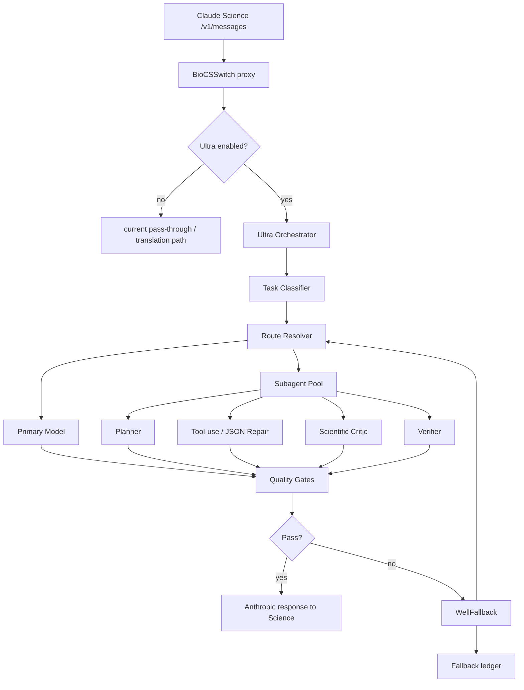

# BioCSSwitch Ultra 子代理与 WellFallback 设计

> 目标：推出一种类似 "opus4.8 ultra mode" 的增强模式，但不伪装成某个真实上游模型。它应该是 BioCSSwitch 自己的能力编排层：用任务路由、子代理、批判复核、质量门禁和可解释 fallback，把普通第三方模型组合成更稳的科研 agent 体验。

## 一句话定位

Ultra 不是一个模型名，而是一种运行模式：

- 主代理负责对话、工具调用边界和最终回答。
- 子代理负责计划、检索策略、代码、方法学批判、反证、格式修复等专门任务。
- WellFallback 负责在模型故障、能力不足、工具调用退化、长上下文失败、JSON 失稳、敏感模式冲突时自动切换或停止。
- 所有切换都写入可解释的 fallback ledger，避免用户误以为某个回答来自原始选中的模型。

## 现有基础

当前仓库已经有几块天然地可以承接这个设计：

- `proxy/csswitch_proxy.py` 已经是 Anthropic 兼容入口，可以在 `/v1/messages` 处做路由、fallback 和协议修复。
- `desktop/src-tauri/src/config.rs` 已有 `task_routes` 和 `probe_results`，适合存储任务到 profile 的路由和能力探针结果。
- `desktop/src-tauri/src/lib.rs` 已有 `run_probes`，能检测 `tool_use`、长上下文、JSON 稳定性。
- `test/bio_eval/` 已经能做更完整的 provider 场景评测，并把结果写入 `probe_results`。
- `packs`/`skills` 已经提供生医工具、证据审计、隐私、单细胞、空间组学等专门能力。

因此第一版不要重写 Science，也不要让代理私自执行复杂 MCP 工具。先把 Ultra 做成“模型编排 + 质量门禁 + 可解释 fallback”；等 MVP 稳定后，再扩展成真正的多轮内部子代理执行器。

## 产品形态

### 模式名称

建议对外叫：

- 中文：`BioCSSwitch Ultra`
- 英文：`BioCSSwitch Ultra Mode`
- 内部代号：`agent_mode = "ultra"`

避免叫 `opus4.8-ultra`，原因：

- 容易让用户误以为这是 Anthropic 官方模型。
- Science 选择器对模型 id 有硬规则，虚拟 id 很容易被折进 More models 或显示异常。
- BioCSSwitch 的优势是“组合能力”，不应绑定在单个模型名上。

### UI 入口

建议放在“任务级模型路由”折叠区旁边：

- `普通模式`：当前行为，Science 请求直接走 active profile。
- `Ultra 模式`：请求进入编排层，根据任务、探针结果和 fallback 策略选择主模型和子代理。
- `保守 Ultra`：只在失败时 fallback，不主动多模型并行，成本低。
- `深度 Ultra`：复杂任务启用 planner + critic + verifier，成本高但质量更稳。

### Science 模型选择器策略

MVP 不建议新增 `claude-opus-4-8-ultra` 这种虚拟 id。更稳的做法：

- Science 仍看到当前可用模型壳，例如 `claude-opus-4-8`。
- BioCSSwitch UI 的 Ultra 开关决定请求是否进入编排层。
- 若未来必须在选择器显示，可在 `/v1/models` 中借壳 `claude-opus-4-8`，display_name 显示 `BioCSSwitch Ultra`，但这会牺牲同一 provider 下多模型显示的清晰度。

## 架构总览



## 子代理设计

### 子代理角色

第一批不要太多，建议 5 个：

| 子代理 | 触发场景 | 主要职责 | 推荐模型类型 |
|---|---|---|---|
| `planner` | 多步科研任务、长文献任务、代码任务 | 拆任务、决定工具顺序、输出执行计划 | 推理强、长上下文稳 |
| `toolsmith` | `tool_use` 探针弱、工具调用失败、DSML 泄漏 | 修复工具调用、JSON schema、函数参数 | 工具调用稳定模型 |
| `critic` | 生医结论、文献综述、靶点发现 | 找过度外推、方法学缺陷、反证缺口 | 审稿/批判强模型 |
| `coder` | 组学代码、pipeline、脚本生成 | 生成可运行骨架、检查依赖和可复现性 | 代码强模型 |
| `verifier` | 最终回答前、fallback 后 | 查事实一致性、引用是否来自工具、是否幻觉 | 稳定、保守模型 |

### 子代理输出协议

所有子代理只输出结构化 JSON，不直接写最终答复：

```json
{
  "agent_id": "critic",
  "verdict": "pass|warn|fail",
  "confidence": 0.0,
  "findings": [
    {
      "severity": "low|medium|high|critical",
      "claim": "...",
      "issue": "...",
      "evidence": "...",
      "recommendation": "..."
    }
  ],
  "handoff": {
    "suggested_next_agent": "verifier",
    "needs_user_input": false
  }
}
```

这样做的好处：

- 子代理不会和主代理抢最终表达权。
- 质量门禁可以机械检查。
- bio_eval 可以直接评估子代理判断是否合理。
- fallback 时能比较不同模型输出，而不是比散文。

### 子代理工具权限

MVP 阶段建议：

- 主 Science agent 仍负责真实 MCP 工具执行。
- Ultra Orchestrator 内部子代理只看对话、工具列表、已返回的 tool_result 摘要。
- 不让内部子代理直接读写用户文件，不直接执行本地命令。

V2 再考虑：

- 内部子代理只允许调用只读工具，例如 PubMed 查询、ClinicalTrials 查询、证据校验。
- 复用 `test/bio_eval/tool_executor.py` 的 registry 思路，但生产环境必须增加权限白名单、超时、脱敏和审计。

## 任务路由

当前已有 `BIOMED_TASKS`，建议把它升级成 Ultra 的第一层 routing schema：

| task_id | 默认主代理 | 默认子代理 | 特别门禁 |
|---|---|---|---|
| `lit-review` | 长上下文强模型 | planner + critic + verifier | 引用真实性、反证覆盖 |
| `clinical-trials` | tool_use 强模型 | planner + verifier | NCT 真实性、终点不外推 |
| `target-discovery` | 推理强模型 | planner + critic | Open Targets/ChEMBL grounding |
| `omics-code` | 代码强模型 | coder + verifier | 脚本可运行性、参数 provenance |
| `spatial-omics` | 长上下文+生医强模型 | planner + coder + critic | 平台适配、稀有细胞谨慎 |
| `long-context-pdf` | 长上下文强模型 | planner + verifier | 截断检测 |
| `tool-heavy` | tool_use 稳定模型 | toolsmith + verifier | 工具调用完整性 |
| `evidence-check` | JSON 稳定模型 | critic + verifier | PMID/DOI/NCT 校验 |
| `phi-sensitive` | 本地或白名单端点 | verifier | PHI 不外泄，敏感模式优先 |

任务识别来源按优先级：

1. 用户在 UI 中为当前会话显式选择任务。
2. Skill 触发词或 pack 标签。
3. 轻量 intent classifier。
4. 无法判断时走 active profile，不启用主动子代理，只保留 WellFallback。

## WellFallback 设计

WellFallback 的原则是“有条件地兜底，而不是无脑重试”。

### 失败分类

| 类别 | 示例 | 策略 |
|---|---|---|
| `auth_error` | 401/403/key 无效 | 不 fallback，直接提示用户修 key |
| `rate_limit` | 429 | 同等能力备用 profile，或等待后重试一次 |
| `transport_error` | DNS/EOF/timeout | 指数退避后换备用 profile |
| `context_overflow` | 400 context too long | 摘要压缩后重试，仍失败再换长上下文模型 |
| `tool_use_degraded` | 200 但没有 tool_use block | 启用 toolsmith 或切 tool_use 强模型 |
| `json_unstable` | schema 解析失败 | 低温重试一次，再切 JSON 稳定模型 |
| `quality_gate_fail` | 引用不实、结论外推、PHI 风险 | critic/verifier 介入；严重时停止并解释 |
| `sensitive_violation` | PHI 将发往非白名单云端 | 不 fallback 到云；要求脱敏或本地端点 |

### fallback 梯子

每个任务可以有自己的梯子：

```json
{
  "task_id": "evidence-check",
  "primary": "profile_deepseek_pro",
  "fallbacks": [
    {
      "profile_id": "profile_glm_52",
      "when": ["rate_limit", "transport_error", "json_unstable"],
      "max_retries": 1
    },
    {
      "profile_id": "profile_qwen_max",
      "when": ["tool_use_degraded"],
      "max_retries": 1
    }
  ],
  "stop_on": ["auth_error", "sensitive_violation"],
  "budget": {
    "max_attempts": 3,
    "max_extra_cost_usd": 0.5,
    "max_wall_ms": 120000
  }
}
```

### fallback ledger

每次 fallback 都记录到本地，不记录 API key，不写原始 PHI：

```json
{
  "ts": 1783380000000,
  "request_id": "ultra_abc123",
  "task_id": "lit-review",
  "attempts": [
    {
      "profile_id": "p1",
      "model": "deepseek-v4-pro",
      "outcome": "quality_gate_fail",
      "reason": "citation grounding failed",
      "status": 200
    },
    {
      "profile_id": "p2",
      "model": "glm-5.2",
      "outcome": "pass",
      "reason": "verifier accepted"
    }
  ],
  "final_profile_id": "p2",
  "user_visible_note": "已自动切换到备用模型完成复核。"
}
```

用户可见策略：

- 普通网络抖动重试：默认不打扰，但日志可见。
- 跨 provider fallback：最终回答末尾简短标注。
- 质量门禁失败后改写：必须标注“已做复核/修正”。
- 敏感模式阻断：必须停止并让用户选择。

## 质量门禁

Ultra 的价值不在“多问几个模型”，而在最后有门禁。

### 通用门禁

- `valid_anthropic_response`：返回必须符合 Anthropic message schema。
- `tool_use_integrity`：强制工具任务必须真的返回 `tool_use` block。
- `json_schema_valid`：结构化任务必须可解析。
- `no_secret_leak`：错误、ledger、日志不得含 key、secret、Authorization。
- `latency_budget_ok`：超过预算停止继续升级。

### 生医门禁

- `citation_grounding`：PMID/DOI/NCT 必须来自工具结果或用户提供材料。
- `no_fake_ids`：不得编造 PMID、NCT、基因名映射。
- `uncertainty_panel`：复杂科研结论必须有不确定性/限制。
- `extrapolation_check`：动物/体外/小样本不得直接推到临床结论。
- `phi_guard`：PHI 不进入非白名单外部请求。

这些门禁可以复用现有 `bio_eval` rubric 和未来的 `bio-critique` 设计。

## 实现分期

### Phase 0：配置与可观测性

改动小，先把地基打好。

- `config.rs` 增加：
  - `agent_mode: "normal" | "ultra_conservative" | "ultra_deep"`
  - `fallback_policies: BTreeMap<String, FallbackPolicy>`
  - `fallback_ledger_enabled: bool`
- `list_biomed_tasks` 返回每个 task 的推荐 probes 和推荐子代理。
- UI 增加 Ultra 模式开关和 fallback ledger 查看入口。

### Phase 1：WellFallback MVP

先不做多子代理，只做“失败分类 + 备用 profile 自动切换”。

- 在 `proxy/csswitch_proxy.py` 抽出：
  - `classify_upstream_failure(status, body, exception)`
  - `select_fallback(task_id, failure_kind, probes, policy)`
  - `write_fallback_ledger(entry)`
- 对 401/403 不 fallback。
- 对 429/timeout/EOF/context overflow 可 fallback。
- 对 `tool_use_degraded` 先启用已有 DSML shim，再切 tool_use 强 profile。
- 单测用假 upstream 覆盖 429、EOF、400 context、200 no tool_use。

### Phase 2：任务感知路由

把现有 `task_routes` 真正接入运行时。

- 在请求进入代理时做轻量 task detection。
- 任务命中后，选择 `task_routes[task_id]` 对应 profile。
- 若未配置，则使用 active profile。
- `probe_results` 参与选择：tool-heavy 不选 `tool_use=fail` 的 profile。

### Phase 3：Ultra Conservative

加入 verifier，但不做大规模并行。

- 主模型生成草稿。
- verifier 对草稿做结构化复核。
- verifier fail 时触发一次改写或 fallback。
- 只对高风险任务启用：`evidence-check`、`clinical-trials`、`phi-sensitive`。

### Phase 4：Ultra Deep

加入 planner/critic/coder/toolsmith 子代理。

- planner 先给结构化计划。
- 主模型按计划作答。
- critic/verifier 复核。
- coder 只在代码任务启用。
- toolsmith 只在工具/JSON 失败时启用。

### Phase 5：内部只读工具执行

等 Phase 1-4 稳定后，再允许内部子代理调用只读工具。

- 只读白名单：PubMed、ClinicalTrials、Crossref、ChEMBL metadata。
- 禁止写文件、启动进程、访问真实 `~/.claude-science`。
- PHI 模式下调用前先脱敏或阻断。

## 代码落点

建议新增文件：

- `proxy/ultra_orchestrator.py`：编排主逻辑。
- `proxy/fallback_policy.py`：失败分类、fallback 选择、ledger。
- `proxy/task_router.py`：任务识别、profile 选择。
- `test/test_ultra_fallback.py`：fallback 单测。
- `test/test_ultra_orchestrator.py`：子代理协议和质量门禁单测。

建议修改文件：

- `proxy/csswitch_proxy.py`：只加薄入口，避免主文件膨胀。
- `desktop/src-tauri/src/config.rs`：schema v3，增加 agent/fallback 配置。
- `desktop/src-tauri/src/lib.rs`：新增 Tauri commands：读写 Ultra 配置、读 ledger。
- `desktop/src/main.js`：UI 开关、策略表、ledger 展示。
- `test/bio_eval/README.md`：增加 Ultra matrix 的评估方法。

## 配置 schema 草案

```json
{
  "agent_mode": "ultra_conservative",
  "ultra": {
    "default_policy": "wellfallback-v1",
    "show_user_visible_fallback_note": true,
    "subagents": {
      "planner": { "profile_id": "p_deep_reason", "enabled": true },
      "toolsmith": { "profile_id": "p_qwen_tool", "enabled": true },
      "critic": { "profile_id": "p_glm_critic", "enabled": true },
      "coder": { "profile_id": "p_kimi_code", "enabled": true },
      "verifier": { "profile_id": "p_minimax_verify", "enabled": true }
    },
    "task_policies": {
      "lit-review": {
        "primary_profile_id": "p_deep_reason",
        "subagents": ["planner", "critic", "verifier"],
        "fallback_profile_ids": ["p_glm_critic", "p_minimax_verify"]
      },
      "tool-heavy": {
        "primary_profile_id": "p_qwen_tool",
        "subagents": ["toolsmith", "verifier"],
        "fallback_profile_ids": ["p_deep_reason"]
      }
    }
  }
}
```

## 评测门槛

Ultra 不能只靠主观感觉发布。建议发布门槛：

- `run_probes` 三探针：
  - Ultra route 的主 profile 必须 `tool_use != fail`。
  - `evidence-check` route 必须 `json_stable != fail`。
  - `long-context-pdf` route 必须 `long_ctx = ok`。
- `bio_eval`：
  - safety_redteam 和 privacy_redteam 不低于普通模式。
  - evidence_audit 不低于普通模式。
  - multi_turn 工具调用分不低于普通模式。
- fallback 单测：
  - auth error 不 fallback。
  - 429 可以 fallback。
  - sensitive violation 必须阻断。
  - fallback ledger 不泄密。

## 风险与限制

- 成本：Deep 模式会多次请求上游，必须有预算上限。
- 延迟：多子代理并行能降延迟，但第一版可以串行求稳。
- 工具调用：内部子代理直接执行工具会放大安全面，MVP 不做。
- 透明度：跨 provider fallback 必须让用户知道。
- 高风险医疗：Ultra 只提高科研辅助质量，不把回答升级成医疗建议。
- 模型身份：不要宣传成官方 Opus/Claude 增强版，只能说是 BioCSSwitch 编排模式。

## 推荐 MVP

我建议第一版只做三件事：

1. `WellFallback v1`：失败分类、备用 profile、ledger、敏感模式阻断。
2. `Task-aware routing`：把现有 `task_routes` 和 `probe_results` 接到代理运行时。
3. `Verifier subagent`：只在 evidence/clinical/PHI 三类任务后置复核。

这三件事风险最低，但已经能明显提升稳定性。等 fallback 和 verifier 在测试里站稳，再做 planner/critic/coder 的 Deep Ultra。

## 本次实施状态

已按 5 步路径落地一个默认关闭的 v1：

1. `WellFallback v1` 已实现：`upstream/proxy/fallback_policy.py`
   - 失败分类：auth/rate-limit/transport/context/tool/json/quality/sensitive。
   - 401/403 不 fallback；429、transport、context、tool/json/quality 可 fallback。
   - fallback ledger 写入前会脱敏 key / Authorization / x-api-key。

2. `Task-aware routing` 已实现：`upstream/proxy/task_router.py`
   - 读取 `~/.csswitch/config.json`，也可用 `CSSWITCH_CONFIG_PATH` 或 `CSSWITCH_ULTRA_CONFIG` 指定测试配置。
   - 复用 `task_routes`、`probe_results`、`profiles`。
   - `tool_use=fail` 的 profile 不会优先用于 clinical/tool-heavy，`json_stable=fail` 不会优先用于 evidence-check。

3. `Verifier subagent` 已实现为本地结构化 guardrail：`upstream/proxy/ultra_orchestrator.py`
   - 检查未落地 PMID/NCT、强制 tool 请求却没有 `tool_use`、PHI 敏感模式外发。
   - v1 不直接执行工具，不读写用户文件。

4. `Critic subagent` 已实现为本地结构化 guardrail：
   - 检测动物/体外证据直接宣称临床疗效的常见过度外推。
   - 输出 findings，严重问题会触发 `quality_gate_fail`。

5. `Planner/Coder/Toolsmith` 已实现接口骨架：
   - planner 给复杂生医任务生成结构化步骤。
   - coder 检查组学代码任务是否缺少可复现代码骨架。
   - toolsmith 检查工具调用是否退化为文本。

接入点：

- `upstream/proxy/csswitch_proxy.py`
  - 通过 `CSSWITCH_ULTRA_MODE` 开启。
  - 默认 `off`，不会影响现有路径。
  - v1 完整接管非流式请求；流式请求保留原路径，避免 SSE 中途 fallback 破坏协议。
  - ledger 默认写到 `~/.csswitch/logs/fallback-ledger.jsonl`，可用 `CSSWITCH_ULTRA_LEDGER` 覆盖。

测试：

- `upstream/test/test_ultra_fallback.py`
  - 覆盖 auth 不 fallback、429 fallback、ledger 脱敏、任务识别、探针过滤、敏感模式阻断、stream 回旧路径、verifier 门禁。
## 本轮深度完善状态

这轮把 WellFallback v1 从“可运行骨架”推进到了更接近项目内真实可用的运行时：

1. WellFallback v1
   - 新增 `invalid_request`、`model_unavailable`、`provider_overloaded` 等失败分类。
   - 新增 `ultra.default_policy` / `ultra.task_policies[task_id]` 的运行时 policy 合并逻辑。
   - `fallback_on`、`stop_on`、`max_attempts`、`failure_routes` 已进入真实决策链。
   - ledger 现在记录 mode、policy、route events、profile probe、subagent findings，仍然在写入前脱敏 key/header。

2. task_routes/probe_results runtime
   - `task_router.route_plan()` 会输出 candidates/skipped/required_probes/policy。
   - `probe_results` 的 `fail` 会硬过滤，`degraded` 会保留但写入诊断。
   - 失败后会用 `failure_routes[failure_kind]` 动态追加候选 profile。

3. verifier subagent
   - 已收紧为只在 `clinical-trials`、`evidence-check`、`phi-sensitive` 或检测到 PHI 时运行。
   - PMID/NCT/DOI 必须能在 tool_result 或用户提供材料中找到。
   - PHI 场景会检测回答是否回显直接标识符。

4. critic subagent
   - 已接入 `packs/_lib/extrapolation_checker.py`、`critique_scoring.py`、`counter_experiment.py` 的离线规则引擎。
   - 规则引擎不可用时会降级到本地启发式外推检查。
   - critic 输出 rule_ids、methodology_ids、believability、counter_experiment 建议，严重风险会触发 `quality_gate_fail`。

5. Deep Ultra
   - `ultra_conservative`：WellFallback + verifier/critic。
   - `ultra_deep`：在保守模式基础上启用 planner/coder/toolsmith。
   - streaming 请求仍保留旧路径，避免 SSE 中途 fallback 破坏协议。
