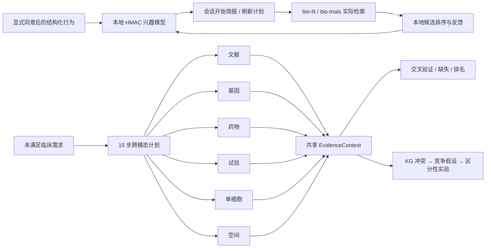

# 主动研究伙伴与跨模态编排

本文描述 BioCSSwitch 当前已经实现的两条能力链：`bio-research-partner` 的隐私优先个性化，以及 `bio-crossmodal` + `bio-kg` 的跨模态证据整合与矛盾驱动假设生成。

## 总体架构



两条链共享三条铁律：原始患者信息不进入模型状态；缺失证据不等于反证；生成的假设和分析配方不等于实验结果。

## 1. 本地研究兴趣模型

### 1.1 允许的行为事件

| 行为 | event kind | 学习含义 |
|---|---|---|
| 保存论文 | `paper_saved` | 对规范化主题增加强正权重 |
| 查询基因/靶点 | `entity_queried` | 增加关注度；重复查询自然累积 |
| 接受建议 | `suggestion_accepted` | 中等正反馈 |
| 拒绝建议 | `suggestion_rejected` | 弱负反馈，避免一次拒绝抹掉长期兴趣 |
| 完成工作流 | `workflow_observed` | 更新粗粒度时段 × task 预测 |
| 展示推荐 | `recommendation_shown` | 更新 HMAC 去重与 cooldown，不改变主题分 |

事件只接受 canonical topics、短 task slug 和公开稳定 ID。`raw_query`、标题、摘要、笔记、文件路径和任意 metadata 会被 schema 拒绝。

### 1.2 存储与隐私

- 学习默认关闭；`research_interest_observe` 要求每次显式传入 `consent=true`。
- 默认 profile 为 `~/.csswitch/research_partner/profile.json`，可用 `BIOCSSWITCH_INTEREST_PROFILE_PATH` 改到用户指定的本地位置。
- topics 与 item IDs 使用单独 256-bit key 做 HMAC-SHA256；profile 与 key 分文件保存。
- profile 只含衰减聚合值、计数、ordinal day、粗粒度时间桶和已展示项目 HMAC；不保留逐事件历史。
- 写入采用 lock + 临时文件 + fsync + atomic replace，拒绝 symlink，损坏 profile 不会被静默覆盖；权限 best-effort 0700/0600。
- `research_interest_inspect` 不返回 HMAC token；`research_interest_delete(confirm=true)` 删除 profile 与 key。

HMAC 不可逆，因此生成可读 watch query 时必须提供一个已经在本地存在的 `topic_catalog`，例如保存论文的主题、项目概念或本地 KG 节点。系统在内存中 HMAC 后匹配；没有匹配就返回 `insufficient_local_context`，不会猜测兴趣。

### 1.3 主动简报的诚实边界

`research_session_brief` 会返回工作流预测和四类刷新动作：PubMed、bioRxiv、medRxiv、ClinicalTrials.gov。默认每个动作都是 `requires_consent`，且函数本身不执行网络请求。宿主或模型只有在已有策略明确允许时，才能执行这些公开数据库查询；检索结果随后转换成 candidate schema，并由 `research_updates_rank` 在本地排序。

当前实现的是 session-start proactive pull。持久化桌面 consent、定时 scheduler、系统通知和离线队列属于宿主层后续集成，不应被文档或 UI 冒充为已启用。

## 2. 矛盾驱动的假设生成器

`kg_generate_hypotheses` 接受 `kg_conflict_scan` 的冲突，或从 triples / graph path 自行扫描。因 `causal_kg.normalize_triple` 现在会保留 species、population、tissue、cell_state、dose、timepoint、endpoint、method 和 study_design，生成器能够判断两个相反结果是否可能来自作用条件不同，而不仅是简单地投票。

每个 contradiction report 包含：

1. `observed_conflict`：仅陈述两个已存边及其 provenance；不裁决谁正确。
2. `generated_hypotheses`：context effect modification、dose/time sign switch、method/endpoint artifact、adaptive feedback/intermediate、bias/noncausal 五类竞争解释。
3. `predictions`：每个假设的支持与反驳观察，均标记 `not_tested`。
4. `discriminating_experiments`：交叉条件设计、剂量/时间序列、正交 assay/复现三类实验，并带 `bio-experiment.agentic_experiment_plan` handoff。
5. `key_data_needs`：缺失协变量、signed effect、置信区间、replicate/unit of inference、原文片段和来源独立性。
6. `uncertainty`：启发式可解性而非校准后验概率。

生成内容从不自动写回 KG。只有实验或审计后的外部证据才能成为新 edge。

## 3. 跨模态 EvidenceContext

### 3.1 编排状态机

`crossmodal_plan_unmet_need` 从 disease + unmet_need 生成 15 步 DAG，并返回空 EvidenceContext。plan、context 和每个 step 分别携带 `plan_id`、`context_id`、`need_receipt` 与内容寻址的 `step_receipt`；reducer 会拒绝跨疾病、跨计划或被篡改的 step。调用方按 stage 执行真实 pack 工具，将每个结果连同原 plan step 传给 `crossmodal_reduce_evidence`。动态引用支持：

- `$outputs.<step>.<path>`：引用上游真实工具输出，例如 disease EFO ID。
- `{target}`：对当前候选靶点 fan-out。
- `$context.candidate_target_symbols`：使用共享 context 中已规范化的候选列表。

单个 pack 失败只记入 execution log；其他模态继续运行。`crossmodal.orchestrate(need, executor)` 提供 callback 版本，供未来代理/宿主直接接入 MCP executor。

### 3.2 Evidence record

每条 evidence record 至少包含：

```json
{
  "modality": "literature | gene | drug | trials | single_cell | spatial",
  "source_pack": "bio-lit",
  "source_tool": "pubmed_search",
  "claim_type": "disease_literature_support",
  "target": "EGFR",
  "effect": "supports | contradicts | neutral",
  "strength": 0.0,
  "quality": 0.0,
  "source_ids": ["PMID:..."],
  "context": {},
  "provenance": {}
}
```

记录按内容寻址 ID 幂等去重。同一 PMID/DOI/NCT 即使由不同 pack 返回也只计一个独立来源；同义 claim（例如 `disease_association` 与 `disease_literature_support`）在验证时归入同一 claim family。原始大 payload 不进入 context，只保留规范化证据、source IDs 和 payload hash。带 `error`、`timeout` 或失败 status 的工具返回会进入失败路径，绝不被解释为“零命中”。

### 3.3 交叉验证和排序

`crossmodal_synthesize` 同时返回 coverage、cross-validation 和 ranking：

- 同一 claim 有显式 supports 与 contradicts → `contested`。
- 至少两个独立模态与来源支持 → `cross_modally_corroborated`。
- 只查到一类来源 → `single_modality_support`。
- 没有记录 → `unassessed`，绝不自动转换为“无关联”。

排序维度为 biological basis、druggability、single-cell/spatial translational specificity、observed clinical novelty、evidence diversity 和 evidence quality，再扣除显式 contradiction penalty。无 trials 数据时 novelty prior 固定为中性 0.5；只有真实 trial search 的零命中才可解释为 observed low saturation。最终分数只表示研究优先级，不表示疗效、安全性或临床可用性。

## 4. 推荐调用顺序

主动伙伴：

```text
explicit opt-in
→ research_interest_observe (多次、仅结构化事件)
→ research_session_brief(topic_catalog, allow_remote_queries=false)
→ 用户/策略授权后执行 bio-lit / bio-trials actions
→ research_updates_rank
→ recommendation_shown / accepted / rejected feedback
```

跨模态发现：

```text
crossmodal_plan_unmet_need
→ 按 DAG 调各 pack
→ 每次 crossmodal_reduce_evidence
→ measured sc/spatial observations 用 crossmodal_integrate_observations
→ crossmodal_synthesize
→ 若 contested：kg_generate_hypotheses
→ 选中实验 handoff 到 bio-experiment
```

## 5. 验证

专项离线测试覆盖：未同意零写入、profile 不含原始 topics/IDs、衰减与时段预测、拒绝建议的弱负反馈、候选去重/冷却、默认网络门、删除/损坏/symlink 边界、15 步动态编排、六 pack callback、单模态失败继续、recipe 不计证据、缺失不作反证、冲突去重、竞争假设/预测/实验分层和 MCP 注册。
